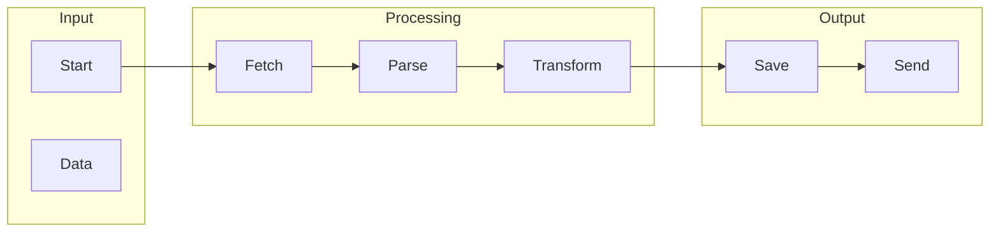

# n8n

## What is n8n
n8n is a tool designed to automate workflows by connecting different apps and services without requiring custom code. It aims to fill the gap left by existing solutions like Zapier, IFTTT, and custom scripts, which either lacked flexibility or required coding knowledge. By providing a more user-friendly and flexible way to automate workflows, n8n helps users to streamline their tasks and improve productivity.

## What problem it solves
The rise of cloud-based apps and services has led to an increase in the number of tools available, making it cumbersome to manually move data between them. Before n8n, automation was mostly done through custom scripts or manual workflows, which were time-consuming and inefficient. n8n solves this problem by providing a platform to automate these tasks, allowing users to focus on more important things.

## How it works internally
Internally, n8n works by breaking down workflows into a series of tasks or operations that are executed in a specific order. These workflows are made up of nodes, which represent individual operations or tasks, such as sending an email or making an API call. There are various types of nodes, including trigger nodes, action nodes, function nodes, and condition nodes, each with its own specific function. Triggers are special nodes that initiate the execution of a workflow, and can be set up to activate at specific times or when certain events occur.

## Workflow overview
A workflow in n8n is essentially a graphical representation of a process that automates a sequence of actions. The workflow can have multiple nodes, triggers, and conditions that determine how data flows through it. The following diagram illustrates a basic workflow:

This diagram shows a simple workflow that fetches data, parses it, transforms it, saves it, and then sends it.

## Step by step execution flow
The execution flow in n8n can be broken down into several steps:
1. **Trigger Activation**: A trigger node is activated, either by a schedule, an external event, or manual start.
2. **Node Execution**: The first node in the workflow starts executing, which may fetch data, perform an action, or simply pass on data to the next node.
3. **Data Passing**: The output of one node is passed as input to the next node in the sequence, which can include data manipulation or transformation.
4. **Conditional Logic**: If a condition node is encountered, the workflow evaluates the condition, and based on the outcome, the workflow may branch out to different paths.
5. **Iteration**: Some nodes can iterate over arrays of data, executing the same operation multiple times.
6. **Error Handling**: If any node fails during execution, the workflow can be configured to handle the error, either by stopping, skipping to a specific node, or continuing with a fallback path.

## Real world use cases
n8n can be used in a variety of real-world scenarios, such as:
* Automating social media posting: A company can use n8n to connect their blog's RSS feed to their social media accounts, automatically posting new articles to Twitter, Facebook, and LinkedIn.
* Streamlining customer support: An e-commerce business can use n8n to integrate their customer support email account with their CRM system, automatically creating new customer records and support tickets.
* Centralizing data from multiple sources: A marketing agency can use n8n to collect data from various sources, including Google Analytics, Facebook Ads, and email marketing software, and store it in a central database.

## Limitations and trade-offs
While n8n provides a flexible and user-friendly way to automate workflows, it is not without its limitations. For example, n8n may not be suitable for complex workflows that require custom code or advanced logic. Additionally, n8n may have performance issues if the workflow is too large or complex. However, these limitations can be mitigated by breaking down large workflows into smaller, more manageable pieces, and by using the built-in error handling and debugging tools.

## Practical closing thoughts
 n8n is a powerful tool for automating workflows, providing a flexible and user-friendly way to connect different apps and services. By understanding how n8n works internally, and by using the built-in nodes and triggers, users can create complex workflows to streamline their tasks and improve productivity. While n8n may have its limitations, it is a valuable tool for anyone looking to automate their workflows without requiring custom code. With its easy-to-use interface and flexible workflow design, n8n is an ideal solution for businesses and individuals looking to simplify their workflows and improve their overall efficiency.