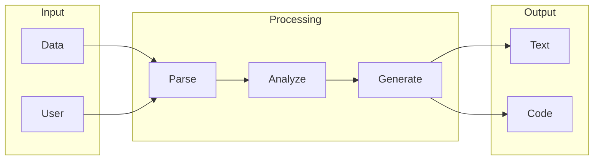

# Langchain

## What is Langchain
Langchain is a tool designed to simplify the process of building applications that utilize large language models. It aims to make it easier for developers to work with these complex models by providing a more streamlined way of integrating them into apps. Before Langchain, developers had to handle the underlying infrastructure, which was time-consuming and required a lot of expertise.

## What problem it solves
Langchain solves the problem of tedious and error-prone integration of language models into applications. Prior to tools like Langchain, automation was handled through custom scripts and manual configuration, which was not scalable. Langchain abstracts away these complexities, providing a more straightforward way of building applications that leverage large language models. This allows developers to focus on the application itself, rather than the underlying infrastructure.

## How it works internally
From an engineering perspective, Langchain works internally using its underlying workflow engine, n8n. A workflow in n8n is a series of automated tasks that are executed in a specific order, essentially a flowchart that defines how data moves through the system. Each step in the workflow represents a specific action or operation. Nodes are the building blocks of a workflow in n8n, representing a single operation or action, such as sending an HTTP request, processing text, or interacting with a database.

## Workflow overview
The workflow in Langchain can be visualized as follows:

This diagram shows the overall flow of data through the system, from input to output. The workflow involves receiving user input, processing the input text, sending the processed text to a language model for analysis, receiving the response, post-processing the response, and sending the final response back to the user.

## Step by step execution flow
The execution flow in Langchain involves the following steps:
- Receive user input through a trigger
- Process the input text using a node
- Send the processed text to a language model node for analysis
- Receive the response from the language model node
- Post-process the response using another node
- Send the final response back to the user
Logic and conditions are evaluated using special nodes in n8n, such as the "If" node or the "Switch" node. These nodes allow you to make decisions based on the data flowing through the workflow.

## Real world use cases
Langchain has several real-world use cases, including:
* A researcher using Langchain to automate the process of summarizing and organizing large amounts of text data from academic papers.
* A content writer utilizing Langchain to generate ideas and outlines for articles.
* A customer support team employing Langchain to generate responses to common customer inquiries.
These use cases demonstrate the versatility of Langchain in simplifying the process of building applications that utilize large language models.

## Limitations and trade-offs
While Langchain simplifies the process of building applications that utilize large language models, it is not without its limitations and trade-offs. For example, the use of a workflow engine like n8n may introduce additional complexity, and the evaluation of logic and conditions may require a simple scripting language like JavaScript. Additionally, the performance of Langchain may be affected by the underlying infrastructure and the complexity of the workflow.

## Practical closing thoughts
 Langchain is a powerful tool for simplifying the process of building applications that utilize large language models. By providing a more streamlined way of integrating language models into apps, Langchain allows developers to focus on the application itself, rather than the underlying infrastructure. While it has its limitations and trade-offs, Langchain has the potential to revolutionize the way we build applications that leverage large language models. As with any new technology, it is essential to approach Langchain with a critical and nuanced perspective, considering both its benefits and limitations. By doing so, we can unlock the full potential of Langchain and create innovative applications that transform the way we interact with language models.