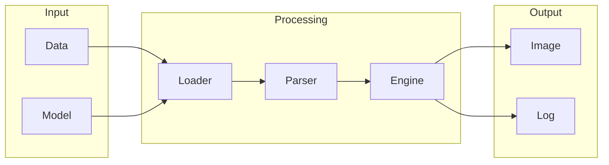

# stable-diffusion-webui

## What is stable-diffusion-webui
Stable-diffusion-webui is a web interface designed to simplify the process of using stable diffusion models, which generate images from text prompts. These models are complex and typically require technical expertise to use, making them inaccessible to non-technical individuals. The webui aims to bridge this gap by providing a user-friendly interface for interacting with these models.

## What problem it solves
The primary problem that stable-diffusion-webui solves is the complexity and technical barriers associated with running stable diffusion models. Before the development of this tool, users had to install software, configure environments, and write code to generate images, which was time-consuming and required significant programming knowledge. The webui eliminates these barriers, allowing users to generate images from text prompts without needing to write code or have extensive technical expertise.

## How it works internally
Internally, stable-diffusion-webui is built using the n8n workflow automation tool. n8n is a platform that enables users to create custom workflows by connecting different nodes, each representing a specific task or operation. These nodes can be connected to form a workflow, and data can be passed between them. The webui leverages this functionality to automate the process of generating images from text prompts.

## Workflow overview
The workflow of stable-diffusion-webui can be visualized using the following diagram:

This diagram illustrates the flow of data through the system, from input to output. The input stage involves loading the data and model, which are then processed by the parser and engine to generate an image. The output stage includes the generated image and any logs or error messages.

## Step by step execution flow
The execution flow of stable-diffusion-webui can be broken down into several steps:
1. **Trigger Activation**: The workflow is triggered by an event, such as a user submitting a text prompt.
2. **Node Execution**: The first node in the workflow is executed, which loads the input data and model.
3. **Data Passing**: The output data from the first node is passed to the next node in the workflow, which parses the input data.
4. **Node Processing**: The parser node processes the input data and passes the output to the engine node.
5. **Image Generation**: The engine node generates an image based on the parsed input data.
6. **Output**: The generated image is output, along with any logs or error messages.

## Real world use cases
Stable-diffusion-webui has several real-world use cases, including:
* Artists can use the webui to generate reference images for their paintings by inputting text descriptions of the desired scene.
* Architects can use the webui to quickly generate 2D layouts and facades of buildings based on textual descriptions.
* Graphic designers can use the webui to produce concept art for advertisements by inputting keywords related to the product and desired visual style.

## Limitations and trade-offs
While stable-diffusion-webui provides a user-friendly interface for interacting with stable diffusion models, it is not without limitations. One of the primary limitations is the complexity of the underlying models, which can result in inconsistent or unexpected output. Additionally, the webui may not provide the same level of control or customization as working directly with the models, which can be a trade-off for the ease of use it provides.

## Practical closing thoughts
 stable-diffusion-webui is a powerful tool that simplifies the process of using stable diffusion models to generate images from text prompts. By providing a user-friendly interface and automating the underlying complexity, the webui makes it possible for non-technical individuals to leverage these models in their work. While it has limitations and trade-offs, the webui has the potential to democratize access to these models and enable new use cases and applications. As the technology continues to evolve, it will be interesting to see how the webui and similar tools adapt to meet the needs of users and push the boundaries of what is possible with stable diffusion models.