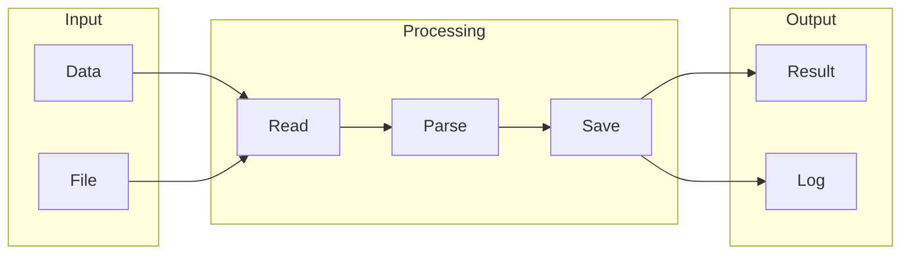

# dify

## What is Dify
Dify is a tool designed to simplify data integration and automation processes. At its core, it aims to make it easier to connect different data sources, transform the data, and load it into a target system. This is a common challenge many teams face, and Dify is one of the solutions built to address this issue. By understanding what Dify is, we can better appreciate how it works and the problems it solves.

## What problem it solves
Before tools like Dify, data integration was often a complex and time-consuming task. This was largely due to the manual effort required to handle different data sources, formats, and ensure data consistency. Automation was typically handled through custom scripts, manual data entry, or legacy ETL (Extract, Transform, Load) tools, which were not only error-prone but also required significant technical expertise. Dify was built to provide a more efficient, scalable, and user-friendly way to automate data integration and workflow processes.

## How it works internally
Internally, Dify (also known as n8n) works by using a concept called workflows, which are essentially directed graphs consisting of nodes connected by edges. Each node represents a specific task or operation, such as sending an email, making an API call, or transforming data. These nodes have inputs and outputs that allow them to receive and send data to other nodes, making them the building blocks of a workflow. Triggers are special types of nodes that initiate the execution of a workflow, acting as event listeners waiting for a specific event to occur before executing the workflow. 

## Workflow overview
To better understand how Dify works, let's take a look at a high-level overview of its workflow process, illustrated in the following diagram:

This diagram shows how data flows from input sources, through processing nodes, and finally to output destinations. It's a simplified example but gives a clear idea of how different components interact within a Dify workflow.

## Step by step execution flow
The execution flow in Dify starts when a trigger is activated. Here's a step-by-step breakdown of how it works:
- The trigger node is executed, starting the workflow.
- The output of the trigger node is passed to the next node in the workflow, following the edges defined between nodes.
- Each node in the workflow is executed in sequence, with the output of each node being passed to the next.
- If a node has multiple outputs, the workflow can split into multiple branches, allowing for conditional logic and parallel execution.
- If a node has multiple inputs, the workflow can merge multiple branches, allowing for combining data from different sources.
Nodes can also have conditions that determine whether they should be executed or not, and they can include logic functions like IF statements, loops, and switches for more complex decision-making and data processing.

## Real world use cases
Dify has various real-world use cases across different fields. For instance:
- Data scientists use Dify to integrate their Python scripts with SQL databases, simplifying the process of creating tables and inserting data.
- Software developers utilize Dify to automate the deployment of their applications to cloud platforms, generating necessary configuration files and scripts.
- Business analysts employ Dify to generate reports from large datasets, creating SQL queries and visualizations based on their data models.
These examples illustrate how Dify can streamline data integration and automation tasks, making it a valuable tool for professionals in different disciplines.

## Limitations and trade-offs
While Dify offers a lot of benefits in terms of simplifying data integration and automation, it's not without its limitations and trade-offs. For example, the ease of use and visual interface might not be sufficient for extremely complex workflows, requiring a deeper understanding of the underlying technology. Additionally, the learning curve for advanced features can be steep, and there might be performance considerations for very large datasets. It's essential to weigh these factors when deciding whether to use Dify for a particular project.

## Practical closing thoughts
 Dify is a powerful tool for data integration and automation, offering a user-friendly interface and a robust set of features for managing complex workflows. By understanding how Dify works and its real-world applications, professionals can better leverage its capabilities to streamline their data-related tasks. While it's not a perfect solution for every scenario, its benefits in terms of efficiency, scalability, and ease of use make it a worthwhile consideration for many projects. As with any tool, it's crucial to evaluate its fit for your specific needs and to be aware of its limitations to maximize its potential.