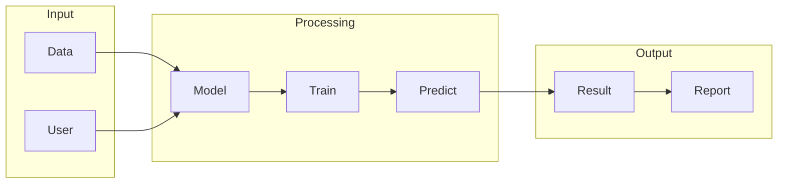

# AutoGPT

## What is AutoGPT
AutoGPT is a tool that utilizes AI models to automate tasks. It aims to make automation more accessible and powerful by leveraging the capabilities of artificial intelligence. The primary goal of AutoGPT is to simplify the process of automating repetitive tasks, making it easier for people to focus on more complex and creative work. By using AI models, AutoGPT can potentially automate more complex tasks and make decisions based on data.

## What problem it solves
The problem that AutoGPT solves is the inefficiency of manually performing tasks that can be automated. Before AutoGPT, automation was handled using scripts, macros, or other programming tools, which required coding knowledge and were often limited in their capabilities. AutoGPT attempts to make automation more accessible and powerful by using AI models, allowing people to automate tasks without needing to learn how to code. This is particularly useful for tasks that are repetitive, time-consuming, or require a high level of precision.

## How it works internally
AutoGPT is built on top of n8n, a workflow automation tool. To understand how AutoGPT works internally, it's essential to break down the components of n8n. The main components of n8n include workflows, nodes, triggers, and logic. Workflows are a series of connected tasks that are executed in a specific order, defining the overall process that needs to be automated. Nodes are the individual tasks within a workflow, representing specific actions such as sending an email, making an API call, or executing a piece of code. Triggers are special nodes that initiate the execution of a workflow, acting as entry points. Logic and conditions are evaluated within specific nodes, allowing you to make decisions based on the input data or previous node outputs.

## Workflow overview
The workflow overview of AutoGPT can be visualized using the following diagram:

This diagram illustrates the overall process of AutoGPT, from input to output. The input stage involves providing data and user parameters to the model. The processing stage includes training and predicting using the AI model. The output stage generates a result and report based on the prediction.

## Step by step execution flow
The execution flow of AutoGPT can be broken down into the following steps:
- The trigger node is activated, either by a schedule or an external event.
- The trigger node executes its task, which might involve fetching data or setting up initial variables.
- The output from the trigger node is passed to the next connected node.
- The next node executes its task, using the input from the previous node as necessary.
- This process continues, with each node executing its task and passing the output to the next node.
- If a node encounters an error, the workflow execution can be stopped, and error handling mechanisms can be triggered.
- Logic nodes are used to evaluate conditions and make decisions based on the input data or previous node outputs.
- The execution flow is directed accordingly, allowing for dynamic workflows that adapt to different input data or scenarios.

## Real world use cases
AutoGPT has various real-world use cases, including:
- A researcher using AutoGPT to assist in literature review by automatically summarizing and categorizing large numbers of academic papers.
- A content writer employing AutoGPT to generate first drafts of articles, which are then edited and polished manually.
- A business analyst utilizing AutoGPT to automate the generation of routine reports by feeding it data and formatting requirements.
These use cases demonstrate the potential of AutoGPT in simplifying repetitive tasks and improving productivity.

## Limitations and trade-offs
While AutoGPT offers many benefits, it also has limitations and trade-offs. One of the primary limitations is the reliance on AI models, which can be complex and require significant computational resources. Additionally, the accuracy of the output depends on the quality of the input data and the training of the AI model. There may also be trade-offs between the level of automation and the need for human oversight and review. Furthermore, the use of AutoGPT may require significant upfront investment in terms of time and resources to set up and train the AI model.

## Practical closing thoughts
 AutoGPT is a powerful tool that can simplify the process of automating repetitive tasks. By leveraging the capabilities of AI models, AutoGPT can potentially automate more complex tasks and make decisions based on data. While it has limitations and trade-offs, the benefits of using AutoGPT can be significant, particularly in terms of improving productivity and reducing the workload. As with any new technology, it's essential to approach AutoGPT with a critical and nuanced perspective, considering both the potential benefits and the potential drawbacks. By doing so, we can unlock the full potential of AutoGPT and harness its power to improve our work and lives.