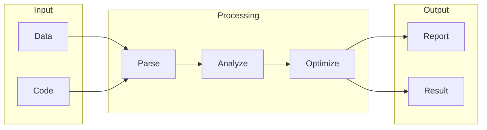

# Faircode

## What is Faircode
Faircode is a tool designed to help with code review and auditing, ensuring that the code is fair and unbiased. It's primarily used to identify and address biases in AI systems, which can perpetuate existing biases if trained on biased data. This leads to unfair outcomes, a significant problem that Faircode aims to mitigate. By automating the auditing process, Faircode makes it easier to build more equitable AI systems.

## What problem it solves
Before Faircode, people had to manually review code and data to catch biases, a time-consuming and error-prone process. Automation was limited to basic testing and validation, without considering fairness and ethics. Faircode solves this problem by providing a systematic way to identify and address biases in code, ensuring that AI systems are fair and trustworthy.

## How it works internally
From an engineering perspective, Faircode (n8n) works by using workflows, nodes, and triggers. A workflow is a series of automated tasks, represented as a directed graph of nodes, where each node performs a specific operation. Nodes can be connected to create a sequence of operations, and there are different types of nodes, including trigger nodes, operation nodes, and condition nodes. Triggers initiate the workflow execution, which can be scheduled or triggered by external events.

## Workflow overview
Here's an overview of the workflow, illustrated in the following diagram:

This diagram shows the input stage, where data and code are fed into the system. The processing stage involves parsing, analyzing, and optimizing the input. The output stage generates a report and result, which can be used to identify and correct biases.

## Step by step execution flow
The execution flow of Faircode works as follows:
* A trigger node is activated, either by a schedule or an external event.
* The trigger node sends a signal to the connected node, which can be an operation node or a condition node.
* The connected node processes the signal and performs its specific operation.
* The node then sends the output to the next connected node, if any.
* This process continues until the end of the workflow is reached.
* If a condition node is encountered, it evaluates the condition and directs the flow to the next node based on the result.

## Real world use cases
Faircode has several real-world use cases:
* Auditing financial models to identify and correct errors in spreadsheet calculations.
* Reviewing and refactoring legacy codebases to improve maintainability.
* Validating and correcting data preprocessing pipelines in data science projects.
In each of these cases, Faircode helps identify and address biases, ensuring that the output is fair and trustworthy.

## Limitations and trade-offs
While Faircode is a powerful tool, it's not without limitations. For example, it may not catch all biases, especially those that are subtle or complex. Additionally, Faircode may require significant computational resources, especially for large datasets. There are also trade-offs between fairness and performance, as ensuring fairness may require additional processing time or resources.

## Practical closing thoughts
 Faircode is a valuable tool for ensuring fairness and transparency in AI systems. By automating the auditing process, Faircode makes it easier to build more equitable AI systems. While it's not perfect, Faircode is a significant step towards addressing the problem of bias in AI. As engineers, we should be aware of the limitations and trade-offs of using Faircode, but it's a powerful tool that can help us build more trustworthy AI systems. By using Faircode and other similar tools, we can work towards creating a more fair and transparent AI ecosystem.