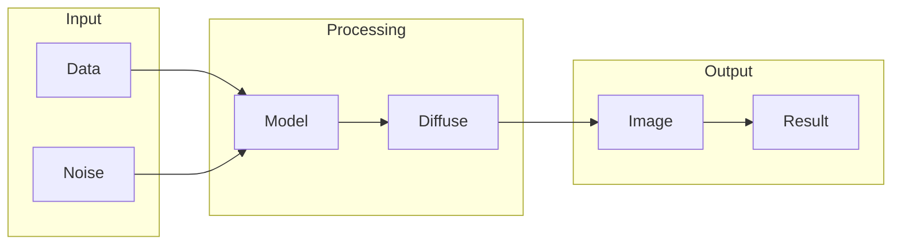

# Diffusion Models

## What is Diffusion Models
Diffusion models are a class of deep learning models designed to generate high-quality data samples, such as images, by iteratively refining noise signals. They have gained popularity in recent years, especially in the field of image and video generation. The primary goal of diffusion models is to produce diverse, realistic, and stable data, which was a challenge with traditional generative models like GANs. These traditional models were prone to mode collapse and unstable training, making it hard to generate high-quality data.

## What problem it solves
The problem that diffusion models solve is the need for more realistic, diverse, and stable data generation. Traditional generative models, such as GANs, had limitations that made it difficult to generate high-quality data. They often produced images that lacked detail or had artifacts, which was not acceptable for many applications. Diffusion models address this problem by providing a new approach to data generation that is more robust and flexible. They can generate high-quality images that are comparable to those produced by traditional models, but with more diversity and stability.

## How it works internally
A diffusion model typically consists of two main components: a forward process and a reverse process. The forward process is a Markov chain that progressively adds noise to the input data until it reaches a completely random distribution. This process can be thought of as a series of noise-adding operations, where a small amount of noise is added to the current state of the data at each step. The reverse process, on the other hand, is a neural network that learns to reverse the forward process, transforming the random noise back into the original data. The reverse process can be thought of as a series of denoising operations, where the neural network learns to remove the noise added in the forward process.

## Workflow overview
The workflow of a diffusion model can be represented by the following diagram:

This diagram shows the main components of a diffusion model, including the input data, noise, model, diffusion process, and output image. The model takes the input data and noise as input, applies the diffusion process, and produces an output image.

## Step by step execution flow
The execution of a diffusion model can be broken down into the following steps:
1. **Data Preparation**: The input data is prepared by normalizing it to a specific range, usually between 0 and 1.
2. **Forward Process**: The forward process is applied to the input data, adding noise at each step until the final state is reached.
3. **Reverse Process**: The reverse process is applied to the final state of the forward process, producing a sample from the original data distribution.
4. **Loss Calculation**: The reconstruction loss and KL divergence loss are calculated between the produced sample and the original data.
5. **Backpropagation**: The gradients of the loss are backpropagated through the reverse process and the forward process.
6. **Weight Update**: The weights of the neural network are updated using the gradients and the optimizer.

## Real world use cases
Diffusion models have several real-world use cases, including:
1. **Image generation for data augmentation**: Diffusion models can be used to generate new images for training datasets by iteratively refining a random noise signal until it resembles a specific class of images.
2. **Anomaly detection in medical imaging**: Diffusion models can be applied to medical images to learn the distribution of normal tissue and identify anomalies.
3. **Text-to-image synthesis for graphic design**: Diffusion models can be used to generate images from text prompts by progressively refining a noise signal until it produces an image that matches the description.

## Limitations and trade-offs
Diffusion models have several limitations and trade-offs, including:
* **Computational complexity**: Diffusion models can be computationally expensive to train and evaluate, especially for large datasets.
* **Mode collapse**: Diffusion models can still suffer from mode collapse, especially if the reverse process is not well-designed.
* **Training instability**: Diffusion models can be unstable during training, especially if the hyperparameters are not well-tuned.

## Practical closing thoughts
 diffusion models are a powerful tool for generating high-quality data samples, especially images. They have several real-world use cases, including image generation for data augmentation, anomaly detection in medical imaging, and text-to-image synthesis for graphic design. However, they also have several limitations and trade-offs, including computational complexity, mode collapse, and training instability. To get the most out of diffusion models, it is essential to carefully design the reverse process, tune the hyperparameters, and monitor the training process. With proper design and implementation, diffusion models can be a valuable addition to any machine learning toolkit.