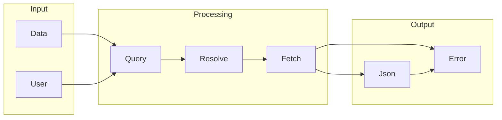

# GraphQL

## What is GraphQL
GraphQL is a query language for APIs that allows for more flexible and efficient data retrieval. It was created to address the issue of over-fetching and under-fetching data in traditional REST APIs. Before GraphQL, APIs would return a fixed set of data, which often led to either too much or too little data being fetched. This problem forced people to build tools like GraphQL, as it was inefficient and wasteful.

## What problem it solves
The main problem that GraphQL solves is the issue of over-fetching and under-fetching data in traditional REST APIs. In the past, developers had to make multiple requests to fetch all the required data or handle large amounts of unnecessary data. GraphQL allows clients to specify exactly what data they need, making it more efficient and flexible. This approach eliminates the need for multiple requests and reduces the amount of unnecessary data that needs to be handled.

## How it works internally
From an engineering perspective, GraphQL is a query language for APIs that allows for more flexible and efficient data retrieval. Here's a step-by-step breakdown of how GraphQL works internally:
* The client sends a GraphQL query to the server, which receives the query and begins processing it.
* The server parses the query string into an Abstract Syntax Tree (AST), which is a tree-like data structure that represents the query in a format that's easier for the server to understand.
* The server validates the query against the schema, which defines the types of data available and the relationships between them.
* Once the query is validated, the server starts executing it, which involves resolving the fields defined in the query.
* Each field in the query has a resolver function associated with it, which is responsible for fetching the data for that field.
* The resolver function fetches the data from the underlying data source, such as a database or another API.
* The resolver function processes the data and returns it to the server, which then combines the data from all the resolver functions to build the response.
* The server constructs the response by combining the data from all the resolver functions and returns it to the client.

## Workflow overview
A workflow is a series of nodes that are connected together to perform a specific task. In the context of GraphQL, a workflow can be thought of as a series of resolver functions that fetch data for specific fields. Here's a diagram that illustrates the workflow overview:

This diagram shows the input, processing, and output stages of a GraphQL workflow. The input stage involves receiving the query and user data, while the processing stage involves resolving the query and fetching the required data. The output stage involves constructing the response and returning it to the client.

## Step by step execution flow
Here's a step-by-step breakdown of the execution flow in GraphQL:
* The client sends a GraphQL query to the server, which receives the query and begins processing it.
* The server parses the query string into an Abstract Syntax Tree (AST) and validates it against the schema.
* The server starts executing the query, which involves resolving the fields defined in the query.
* Each field in the query has a resolver function associated with it, which is responsible for fetching the data for that field.
* The resolver function fetches the data from the underlying data source, such as a database or another API.
* The resolver function processes the data and returns it to the server, which then combines the data from all the resolver functions to build the response.
* The server constructs the response by combining the data from all the resolver functions and returns it to the client.

## Real world use cases
There are several real-world use cases for GraphQL. For example:
* GitHub uses GraphQL for its API, allowing developers to specify the exact data they need when querying repositories.
* Pinterest's mobile app utilizes GraphQL to fetch data for its feed, which includes a list of pins with associated images, descriptions, and other relevant information.
* The New York Times uses GraphQL to manage its content API, which provides access to news articles, images, and other media.

## Limitations and trade-offs
While GraphQL offers several advantages over traditional REST APIs, it also has some limitations and trade-offs. For example:
* GraphQL requires a significant amount of upfront planning and design, as the schema needs to be defined before the API can be implemented.
* GraphQL can be more complex to implement than traditional REST APIs, especially for large and complex datasets.
* GraphQL may require additional infrastructure and resources, such as load balancers and caching layers, to handle the increased complexity and traffic.

## Practical closing thoughts
 GraphQL is a powerful tool for building flexible and efficient APIs. By allowing clients to specify exactly what data they need, GraphQL eliminates the need for multiple requests and reduces the amount of unnecessary data that needs to be handled. While GraphQL has some limitations and trade-offs, it offers several advantages over traditional REST APIs, including improved performance, reduced latency, and increased flexibility. As the demand for more efficient and flexible APIs continues to grow, GraphQL is likely to become an increasingly important tool for developers and engineers.