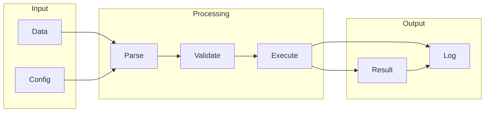

# BloomCTL

## What is BloomCTL
BloomCTL is a tool designed to simplify and automate database management tasks. It appears to exist because of the complexity in managing large-scale databases, particularly with the rise of cloud-native architectures. By providing a more streamlined and automated approach to database management, BloomCTL likely helps reduce the workload and improve overall database performance. At its core, BloomCTL aims to optimize and automate tasks such as query optimization and resource allocation.

## What problem it solves
The problem that forced people to build tools like BloomCTL is likely the difficulty in optimizing and automating database management tasks. Before tools like BloomCTL, automation was probably handled through manual scripting, custom tools, or a combination of both. Database administrators would write scripts to automate repetitive tasks, but this approach can be time-consuming, prone to errors, and difficult to maintain. As databases grew in size and complexity, manual scripting became increasingly inadequate. BloomCTL addresses this issue by providing a more efficient and automated way to manage databases.

## How it works internally
From an engineering perspective, BloomCTL works internally using an underlying workflow engine, n8n. This engine is responsible for defining and executing workflows, which are essentially a series of connected nodes that process and transform data. A workflow definition outlines the structure of the graph, including the nodes, their connections, and the data flow between them. Each node performs a specific task, such as sending an email, making an API call, or transforming data. Nodes can have inputs, which receive data from previous nodes, and outputs, which send data to subsequent nodes.

## Workflow overview
The workflow in BloomCTL can be visualized as a directed graph, where each node represents a specific operation or function. The workflow definition outlines the structure of this graph, including the nodes, their connections, and the data flow between them. Here's a high-level overview of the workflow:

This diagram illustrates the basic flow of data through the workflow, from input to processing to output.

## Step by step execution flow
When a trigger activates a workflow, the execution flow begins. The trigger node sends data to the first node in the workflow, which processes the data and sends its output to the next node. This process continues, with each node processing the data it receives and sending its output to the next node. The execution flow follows the directed graph structure of the workflow, with each node executing in sequence. Here's a more detailed breakdown of the execution flow:
* A trigger node initiates the execution of the workflow.
* The trigger node sends data to the first node in the workflow.
* Each node processes the data it receives and sends its output to the next node.
* The execution flow continues until all nodes have been executed.
* The final output is sent to the output node, which logs the result.

## Real world use cases
BloomCTL has several real-world use cases. For example:
* Network operators use BloomCTL to automate the process of configuring and managing network devices.
* System administrators use BloomCTL to manage and deploy containerized applications.
* Cloud engineers use BloomCTL to manage and automate the provisioning of cloud resources.
These use cases demonstrate the versatility and practicality of BloomCTL in automating database management tasks.

## Limitations and trade-offs
While BloomCTL provides a more streamlined and automated approach to database management, it's not without its limitations and trade-offs. For example:
* BloomCTL may require significant upfront investment in setting up and configuring the workflows.
* The tool may not be suitable for very small or simple databases, where the overhead of setting up and maintaining the workflows may not be justified.
* BloomCTL may introduce additional complexity, particularly if the workflows are complex or have many nodes.
These limitations and trade-offs need to be carefully considered when deciding whether to use BloomCTL.

## Practical closing thoughts
 BloomCTL is a tool that simplifies and automates database management tasks. By providing a more streamlined and automated approach to database management, BloomCTL can help reduce the workload and improve overall database performance. While it's not without its limitations and trade-offs, BloomCTL is a practical solution for managing large-scale databases, particularly in cloud-native architectures. As with any tool, it's essential to carefully evaluate the benefits and drawbacks of using BloomCTL and consider whether it's the right fit for your specific use case.