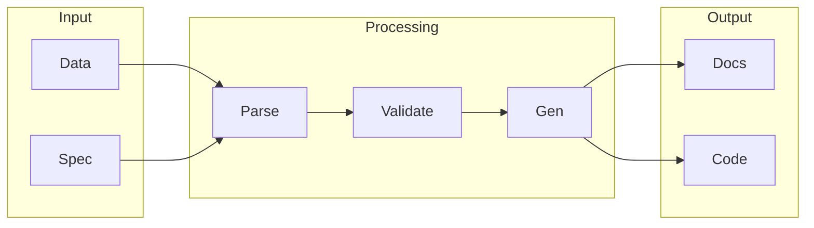

# OpenAPI

## What is OpenAPI
OpenAPI is an interface description format for RESTful APIs. It provides a standardized way to describe and document APIs, making it easier for developers to integrate and use different APIs. Before OpenAPI, each API had its own unique documentation style, which made it tough for developers to integrate and use different APIs. OpenAPI simplifies this process by providing a common language to describe APIs.

## What problem it solves
The problem that forced people to build tools like OpenAPI was the explosion of APIs and microservices. As more services became available, it became clear that a standardized way of describing and documenting them was needed. Without it, developers would have to spend a lot of time figuring out how to use each API, which would be inefficient. OpenAPI solves this problem by providing a standardized way to describe APIs, making it easier to automate integration and testing.

## How it works internally
OpenAPI works internally by providing a standardized way to describe APIs. This description includes information about the API endpoints, parameters, and response formats. This information is used to generate client code and API documentation, streamlining the integration process. OpenAPI also enables automation of integration and testing by providing a common language to describe APIs.

## Workflow overview
The workflow overview of OpenAPI can be represented by the following diagram:

This diagram shows the input, processing, and output stages of the OpenAPI workflow. The input stage includes the data and specification of the API. The processing stage includes parsing, validation, and generation of the API description. The output stage includes the generated documentation and code.

## Step by step execution flow
The step-by-step execution flow of OpenAPI is as follows:
1. A trigger node is activated, starting the workflow.
2. The trigger node passes its output to the next connected node.
3. Each node processes the input data and performs its specific function.
4. The node passes its output to the next connected node.
5. This process continues until the workflow is completed or an error occurs.
For example, in a workflow automation tool like n8n, nodes are connected to each other to create a workflow, allowing data to flow from one node to the next. Each node has a specific function, such as sending an HTTP request or processing data.

## Real world use cases
OpenAPI has several real-world use cases. For example:
* A company like PayPal uses OpenAPI to define and document its payment processing API, which allows developers to integrate payment functionality into their applications.
* The US National Weather Service uses OpenAPI to document its weather API, which provides access to current weather conditions, forecasts, and other meteorological data.
* A healthcare provider like Epic Systems uses OpenAPI to define and document its FHIR API, which allows authorized applications to access and exchange patient health information.
These use cases demonstrate how OpenAPI can be used to streamline the integration process and provide a standardized way to describe and document APIs.

## Limitations and trade-offs
OpenAPI has some limitations and trade-offs. For example, it may require additional effort to create and maintain the API description. Additionally, OpenAPI may not be suitable for all types of APIs, such as APIs with complex business logic or APIs that require a high degree of customization. However, the benefits of using OpenAPI, such as streamlined integration and automated testing, often outweigh the limitations and trade-offs.

## Practical closing thoughts
 OpenAPI is a powerful tool for standardizing the way APIs are documented and described. It provides a common language to describe APIs, making it easier to automate integration and testing. While it may have some limitations and trade-offs, the benefits of using OpenAPI make it a valuable tool for developers and organizations. By providing a standardized way to describe APIs, OpenAPI can help streamline the integration process and reduce the time and effort required to integrate and use different APIs.