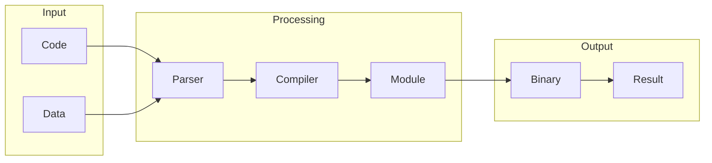

# WebAssembly

## What is WebAssembly
WebAssembly, often abbreviated as Wasm, is a binary instruction format that allows code written in languages like C, C++, and Rust to be executed in web browsers. This is a significant departure from the traditional approach, where JavaScript was the only language that could run in browsers. WebAssembly provides a way to compile code from other languages into a format that browsers can execute, making it easier to build complex web applications. At its core, WebAssembly is designed to provide a safe and efficient way to run code in web browsers, without the need for plugins or other workarounds.

## What problem it solves
Before WebAssembly, developers faced significant limitations when trying to run code in web browsers. Since browsers only understood JavaScript, developers had to either rewrite their code in JavaScript or use workarounds like plugins, which often had security issues. This made it difficult to build complex web applications that required high-performance computations or code written in other languages. WebAssembly solves this problem by providing a way to compile code from other languages into a format that browsers can execute, making it easier to build complex web applications. For example, developers can now use C++ to write high-performance code for web applications, and then compile it to WebAssembly for execution in the browser.

## How it works internally
WebAssembly works by compiling code from languages like C, C++, or Rust into a binary format that browsers can execute. This compiled code is then loaded into the browser, where it is executed in a sandboxed environment. The WebAssembly binary format is designed to be platform-agnostic, meaning that it can run on any device that supports WebAssembly, without the need for recompilation. Inside the browser, WebAssembly code is executed by a runtime environment that provides a set of APIs and interfaces for interacting with the browser and other web pages. This runtime environment is responsible for managing the execution of WebAssembly code, including loading and unloading modules, handling errors, and providing access to browser APIs.

## Workflow overview
The workflow for building and executing WebAssembly code involves several steps. First, developers write their code in a language like C, C++, or Rust. This code is then compiled to WebAssembly using a compiler like `emcc` or `rustc`. The resulting WebAssembly module is then loaded into the browser, where it is executed by the WebAssembly runtime environment. The following diagram illustrates the high-level workflow for building and executing WebAssembly code:

This diagram shows the main stages involved in building and executing WebAssembly code, from compiling the code to loading the resulting module into the browser.

## Step by step execution flow
The execution flow for WebAssembly code involves several steps. First, the WebAssembly module is loaded into the browser, where it is executed by the WebAssembly runtime environment. The runtime environment is responsible for managing the execution of the WebAssembly code, including loading and unloading modules, handling errors, and providing access to browser APIs. The following steps illustrate the execution flow for WebAssembly code:
* **Trigger Activation**: The WebAssembly module is loaded into the browser, and the execution is triggered.
* **Module Loading**: The WebAssembly runtime environment loads the module and prepares it for execution.
* **Code Execution**: The WebAssembly code is executed by the runtime environment, which provides access to browser APIs and interfaces.
* **Data Transformation**: The WebAssembly code can transform data, such as converting it from one format to another or filtering out certain fields.
* **Logic and Conditions**: The WebAssembly code can evaluate logic and conditions to determine whether to continue executing or to branch to a different path.
* **Error Handling**: If an error occurs during execution, the runtime environment can handle it and provide a meaningful error message.

## Real world use cases
WebAssembly has several real-world use cases, including video editing, online code editors, and online gaming platforms. For example, Adobe Premiere Rush uses WebAssembly to run video editing algorithms in the browser, allowing users to edit videos online without installing any plugins. GitHub Codespaces uses WebAssembly to run development environments in the browser, providing users with a cloud-based coding experience. Google Stadia employs WebAssembly to run game engines and other game-related code in the browser, enabling users to play high-performance games without installing any software. These use cases demonstrate the potential of WebAssembly to enable complex web applications that require high-performance computations or code written in other languages.

## Limitations and trade-offs
While WebAssembly provides a powerful way to run code in web browsers, it also has some limitations and trade-offs. One of the main limitations is that WebAssembly code must be compiled to a binary format before it can be executed in the browser. This can make it more difficult to debug and optimize WebAssembly code compared to JavaScript. Additionally, WebAssembly code may not have access to all the browser APIs and interfaces that JavaScript code has, which can limit its functionality. However, these limitations are offset by the benefits of using WebAssembly, including improved performance, security, and compatibility.

## Practical closing thoughts
 WebAssembly provides a powerful way to run code in web browsers, enabling developers to build complex web applications that require high-performance computations or code written in other languages. While it has some limitations and trade-offs, WebAssembly has the potential to revolutionize the way we build web applications. By providing a safe and efficient way to run code in web browsers, WebAssembly enables developers to create new and innovative applications that were previously impossible to build. As WebAssembly continues to evolve and mature, we can expect to see even more innovative applications and use cases emerge, further expanding the possibilities of the web.