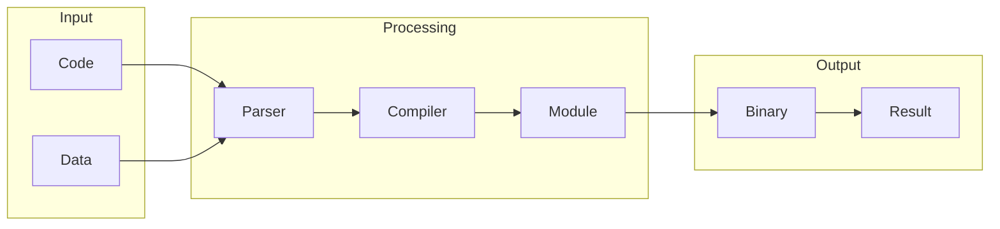

# WebAssembly

## What is WebAssembly
WebAssembly, often abbreviated as WASM, is a binary format that allows code written in languages like C, C++, and Rust to run in web browsers, alongside JavaScript. This technology exists to fill the gap left by JavaScript, which wasn't sufficient for complex computations and performance-critical code. Before WebAssembly, browsers only understood JavaScript, leading to performance issues with demanding tasks.

## What problem it solves
The primary problem WebAssembly solves is the performance issue that arises when running demanding tasks in web browsers using JavaScript. Prior to WebAssembly, automation was handled using JavaScript or plugins like Flash, which had security issues. Developers also used techniques like compiling code to JavaScript, but that wasn't efficient. WebAssembly provides a binary format that can be executed by browsers, allowing for faster and more efficient code execution.

## How it works internally
Internally, WebAssembly works by providing a binary format that can be executed by web browsers. This binary format is compiled from languages like C or C++, and it allows for seamless interaction between the compiled code and JavaScript. The compilation process involves several steps, including parsing, compiling, and module creation. The resulting binary code is then executed by the browser, providing a significant performance boost.

## Workflow overview
The workflow of WebAssembly involves several steps, from code compilation to execution. The process can be visualized using the following diagram:

This diagram illustrates the flow of data and execution, from the input code and data to the output binary and result.

## Step by step execution flow
The execution flow of WebAssembly can be broken down into several steps:
1. **Code Compilation**: The code written in languages like C or C++ is compiled into a binary format.
2. **Module Creation**: The compiled binary code is created into a module that can be executed by the browser.
3. **Browser Loading**: The browser loads the WebAssembly module and prepares it for execution.
4. **Execution**: The browser executes the WebAssembly module, allowing it to interact with JavaScript code.
5. **Result**: The execution of the WebAssembly module produces a result, which is then used by the JavaScript code.

## Real world use cases
WebAssembly has several real-world use cases, including:
* Web browsers like Google Chrome and Mozilla Firefox use WebAssembly to run games and other high-performance web applications.
* The video editing software, Adobe Premiere Rush, uses WebAssembly to run video editing algorithms in the browser.
* The online code editor, GitHub Codespaces, uses WebAssembly to run development environments in the browser.

## Limitations and trade-offs
While WebAssembly provides a significant performance boost, it also has some limitations and trade-offs. For example, the compilation process can be complex, and the resulting binary code may not be compatible with all browsers. Additionally, the use of WebAssembly may require significant changes to the development workflow, including the use of new tools and technologies.

## Practical closing thoughts
 WebAssembly is a powerful technology that allows code written in languages like C, C++, and Rust to run in web browsers, alongside JavaScript. While it has some limitations and trade-offs, the benefits of using WebAssembly, including improved performance and efficiency, make it a valuable tool for developers. As the technology continues to evolve, we can expect to see even more innovative use cases and applications of WebAssembly in the future.