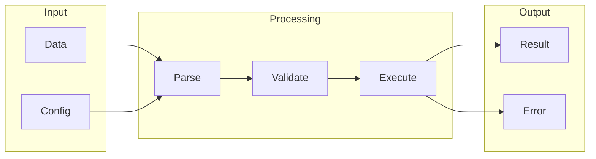

# BloomCTL

# 1. What is BloomCTL
BloomCTL is a tool designed to simplify the management of complex databases and optimize query performance. At its core, BloomCTL aims to provide an efficient and automated way to manage and optimize queries, making it easier for database administrators to handle large-scale databases.

# 2. What problem it solves
The problem that BloomCTL solves is the difficulty in determining optimal query plans, especially in distributed databases. Before tools like BloomCTL, query optimization was likely handled manually or through simple automation scripts. This process was time-consuming, error-prone, and required database administrators to manually analyze query plans, identify bottlenecks, and adjust parameters to optimize performance. By automating this process, BloomCTL reduces the complexity and inefficiency associated with manual query optimization.

# 3. How it works internally
Internally, BloomCTL relies on a workflow engine, n8n, to manage and execute its tasks. In n8n, a workflow is a series of connected nodes that process and transform data. Each node represents a specific function or operation, and nodes can be connected to create a workflow. The workflow engine allows users to automate tasks and processes by configuring nodes with parameters and options. Triggers, which are special nodes, initiate the execution of a workflow in response to external events. The execution flow begins when a trigger is activated, creating an initial data packet that flows through the workflow, triggering the execution of each connected node.

# 4. Workflow overview
The workflow overview can be visualized using the following diagram:

This diagram illustrates the flow of data through the workflow, from input to processing and finally to output.

# 5. Step by step execution flow
The execution flow of BloomCTL's workflow engine, n8n, can be broken down into the following steps:
* The trigger node creates an initial data packet, which contains any relevant data or parameters.
* The data packet is then passed to the next connected node in the workflow.
* Each node processes the data packet, performs its specific function, and then passes the updated packet to the next connected node.
* This process continues until the workflow reaches its end, at which point the final output is generated.
* Logic and conditions are evaluated within nodes or between nodes using specialized nodes, such as "IF" nodes or "Switch" nodes.
* Node execution involves receiving the input data packet, processing it according to configured parameters and options, generating an output data packet, and passing it to the next connected node.

# 6. Real world use cases
BloomCTL has several real-world use cases, including:
* A network administrator using BloomCTL to manage a cluster of Linux servers, by running commands to deploy new nodes, update existing configurations, and monitor system logs.
* A DevOps team utilizing BloomCTL to automate the deployment of containerized applications across a distributed environment.
* A systems engineer employing BloomCTL to manage a fleet of IoT devices, by defining a set of configuration templates and applying them to devices as they join the network.

# 7. Limitations and trade-offs
While BloomCTL provides an efficient and automated way to manage and optimize queries, it is not without its limitations and trade-offs. For example, the complexity of the workflow engine and the need for specialized nodes can make it challenging to configure and manage. Additionally, the reliance on a workflow engine may introduce additional overhead and latency. However, these trade-offs are likely worth it for the benefits of automated query optimization and simplified database management.

# 8. Practical closing thoughts
 BloomCTL is a powerful tool for managing complex databases and optimizing query performance. By understanding how it works internally and its real-world use cases, database administrators and engineers can leverage BloomCTL to simplify their workflows and improve efficiency. While it may have its limitations and trade-offs, the benefits of automated query optimization and simplified database management make it a valuable addition to any database management toolkit. As with any tool, it is essential to carefully evaluate and consider the specific needs and requirements of your use case before implementing BloomCTL.