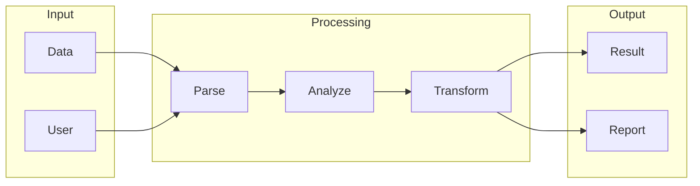

# Dify

## What is Dify
Dify is a tool designed to simplify data integration and processing. It aims to reduce the complexity and manual effort associated with managing data from various sources. By automating data integration and processing, Dify enables users to focus on higher-level tasks and makes data-driven decision-making more accessible. At its core, Dify is built on top of n8n, a workflow automation platform.

## What problem it solves
The problem that Dify solves is the complexity and manual effort required to manage and transform data from various sources. Before tools like Dify, automation was handled through custom scripts, manual data entry, or generic ETL tools. This approach was time-consuming, prone to errors, and required significant technical expertise. Dify addresses these issues by providing a more efficient and user-friendly solution for data integration and processing.

## How it works internally
From an engineering perspective, Dify works by leveraging the n8n workflow automation platform. A workflow in n8n is a series of connected nodes that process and transform data. These nodes are the building blocks of a workflow and can be connected in a specific order to create a flowchart that defines how data should be handled. There are different types of nodes, including trigger nodes, action nodes, and conditional nodes. Triggers are special nodes that start a workflow, and they can be scheduled to run at a specific time or interval, or triggered by an external event.

## Workflow overview
The workflow in Dify can be visualized using the following diagram:

This diagram illustrates the flow of data from input to output, highlighting the different processing stages involved. The workflow can be triggered manually or automatically, and it's the core component of the n8n system.

## Step by step execution flow
The execution flow of a workflow in Dify can be broken down into the following steps:
- The trigger node is activated, either manually or automatically.
- The trigger node sends the input data to the next node in the workflow.
- Each node processes the input data and performs its specific function.
- The output data from each node is passed to the next node in the workflow.
- If a node encounters an error, the workflow can be configured to handle the error, such as by sending a notification or skipping the node.
- The workflow continues to execute until it reaches the end or until it encounters a conditional node that redirects the flow.

## Real world use cases
Dify can be applied to various real-world scenarios, including:
- Extracting customer data from multiple sources and loading it into a centralized data warehouse for analysis.
- Integrating data from social media platforms and online reviews to gather insights on customer sentiment.
- Synchronizing product information across different sales channels, such as websites, online marketplaces, and physical stores.

## Limitations and trade-offs
While Dify simplifies data integration and processing, it's essential to acknowledge its limitations and trade-offs. For instance, the complexity of the workflow may increase as the number of nodes and connections grows. Additionally, the performance of the workflow may be affected by the volume and velocity of the data being processed. Furthermore, the use of a visual workflow editor may introduce limitations in terms of customization and flexibility.

## Practical closing thoughts
 Dify is a tool that simplifies data integration and processing by automating workflows and reducing manual effort. By understanding how Dify works internally and its workflow overview, users can design and implement efficient workflows that meet their specific needs. As with any tool, it's crucial to be aware of its limitations and trade-offs to maximize its benefits. By applying Dify to real-world use cases, users can streamline their data management processes and make data-driven decision-making more accessible. As the complexity and volume of data continue to grow, tools like Dify will play an increasingly important role in simplifying data integration and processing.