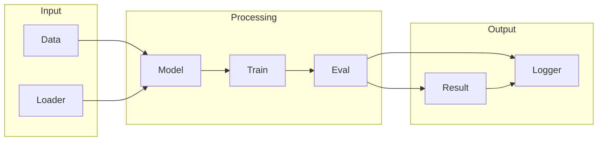

# TensorFlow

## What is TensorFlow
TensorFlow is an open-source software library for machine learning, specifically deep learning. It's designed to help with the complexity of training neural networks, which was previously a time-consuming and error-prone process. Before TensorFlow, data scientists had to write custom code to implement these networks, which limited the size and complexity of models that could be built.

## What problem it solves
The main problem TensorFlow solves is the complexity of training neural networks. Traditional programming methods couldn't handle the complexity and scale of deep learning models, and automation was handled through custom scripting, which was tedious and required a lot of manual tuning. TensorFlow aims to simplify this process, allowing researchers to focus on the actual model development rather than the underlying infrastructure.

## How it works internally
From an engineering perspective, TensorFlow works by representing a series of computations as a graph, where each node in the graph represents a computation or operation. These nodes, also known as operations or ops, take in one or more inputs, perform the computation, and produce one or more outputs. The input data serves as the trigger that sets the computation in motion.

## Workflow overview
The TensorFlow workflow can be thought of as a series of computations that are executed in a specific order. This series of computations is represented as a graph, where each node represents a computation or operation. The workflow can be visualized as follows:

This diagram shows the input data being loaded into the model, which is then trained and evaluated. The results are then logged and output.

## Step by step execution flow
Here's a step-by-step explanation of how execution flows in TensorFlow:
1. **Graph Construction**: The user defines the computation graph using TensorFlow's API.
2. **Input Data**: The user feeds input data into the graph, which serves as the trigger that sets the computation in motion.
3. **Node Execution**: The first node in the graph is executed, taking in the input data and producing output.
4. **Node-by-Node Execution**: Each node in the graph is executed in sequence, with each node taking in the output from the previous node and producing its own output.
5. **Tensor Flow**: The output from each node is represented as a tensor, which is a multi-dimensional array of numerical values.
6. **Graph Execution**: The graph is executed until all nodes have been executed, at which point the final output is produced.

## Real world use cases
TensorFlow has many real-world use cases, including:
* Image classification for self-driving cars: TensorFlow is used to train models that classify images from cameras and sensors on self-driving cars.
* Speech recognition for virtual assistants: TensorFlow is used to build speech recognition models that can transcribe spoken words into text.
* Predictive maintenance for industrial equipment: TensorFlow is used to build models that predict when industrial equipment is likely to fail, based on sensor data.

## Limitations and trade-offs
While TensorFlow is a powerful tool, it's not without its limitations. One of the main limitations is the complexity of the underlying infrastructure, which can be difficult to manage and optimize. Additionally, TensorFlow requires a significant amount of computational resources, which can be a challenge for large-scale deployments.

## Practical closing thoughts
 TensorFlow is a powerful tool for machine learning and deep learning. By understanding how it works internally and how to use it effectively, developers and data scientists can build complex models and solve real-world problems. While it's not without its limitations, TensorFlow is a valuable tool that can help simplify the process of building and deploying machine learning models. As with any technology, it's essential to weigh the benefits and limitations and consider the specific use case and requirements before deciding whether to use TensorFlow.