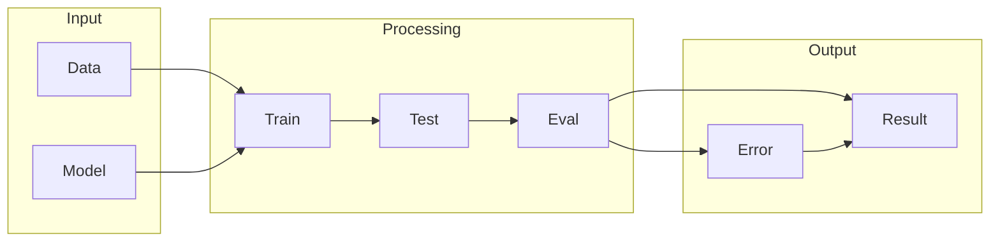

# TensorFlow

## What is TensorFlow
TensorFlow is a tool for machine learning and deep learning. It's designed to make it easier to work with neural networks, which are complex algorithms that can learn from data. At its core, TensorFlow provides a pre-made engine for machine learning, making it more accessible and efficient. This is particularly useful for tasks that require a lot of computational power and expertise in math and optimization.

## What problem it solves
Working with neural networks can be really hard and time-consuming. Before tools like TensorFlow, people had to write a lot of code to implement these algorithms, which was prone to errors. The process of writing code from scratch or using lower-level libraries meant handling all the math and optimization themselves, which was tedious and required a lot of expertise. TensorFlow solves this problem by providing a higher-level library that automates many of these tasks, making it easier to build and train neural networks.

## How it works internally
From an engineering perspective, TensorFlow works by representing computations as a graph, which consists of nodes and edges. The graph is the core data structure that TensorFlow uses to represent and execute computations. Nodes in TensorFlow represent individual operations, such as matrix multiplication, convolution, or activation functions. Each node takes in one or more inputs, performs a specific computation, and produces one or more outputs. Nodes can be thought of as the basic building blocks of the TensorFlow graph. Triggers in TensorFlow are the inputs that initiate the execution of the graph. When a trigger is received, TensorFlow starts executing the graph from the specified starting point.

## Workflow overview
The TensorFlow workflow can be visualized as a series of computations that are executed in a specific order. This workflow is represented as a graph, which consists of nodes and edges. The graph is the core data structure that TensorFlow uses to represent and execute computations. 

As shown in the diagram, the workflow involves feeding data into a model, training the model, testing the model, and evaluating the results. The output of the evaluation can be either a result or an error, which can then be used to refine the model or improve the workflow.

## Step by step execution flow
The execution flow in TensorFlow works as follows:
1. **Graph Construction**: The TensorFlow graph is constructed by creating nodes and edges between them. This graph represents the series of computations that need to be executed.
2. **Session Creation**: A session object is created, which is responsible for executing the graph. The session object manages the resources required to execute the graph, such as memory and compute devices.
3. **Input Feeding**: The inputs to the graph are fed into the session object. These inputs are typically tensors, which are multi-dimensional arrays of numerical values.
4. **Graph Execution**: The session object starts executing the graph, node by node, in the order specified by the graph. Each node takes in its inputs, performs its computation, and produces its outputs.
5. **Output Retrieval**: The outputs of the graph are retrieved from the session object. These outputs can be used as inputs to other graphs or can be further processed.

## Real world use cases
TensorFlow has a wide range of real-world use cases. For example, Google uses TensorFlow in its Google Photos service to classify and categorize images. The workflow involves feeding image data into a TensorFlow model trained on a large dataset of labeled images, which then predicts the content of the image. This prediction is used to organize and retrieve images based on their content. Another example is the use of TensorFlow in self-driving cars to detect and respond to traffic signals. The workflow involves capturing video footage from cameras mounted on the car, processing the footage using a TensorFlow model to detect traffic signals, and then using the detected signals to control the car's actions. TensorFlow can also be used in medical diagnosis to analyze medical images such as X-rays and MRIs.

## Limitations and trade-offs
While TensorFlow provides a powerful tool for building and training neural networks, it's not without its limitations and trade-offs. One of the main limitations is the complexity of the framework, which can make it difficult to learn and use for beginners. Additionally, TensorFlow requires a significant amount of computational resources, which can be a challenge for large-scale deployments. However, these limitations are offset by the flexibility and customizability of the framework, which allows developers to build and train complex neural networks.

## Practical closing thoughts
 TensorFlow provides a powerful tool for building and training neural networks. By understanding how TensorFlow works internally and how to use it effectively, developers can build complex machine learning models that can be used in a wide range of applications. Whether you're working on a project that involves image classification, natural language processing, or recommender systems, TensorFlow provides a flexible and customizable framework that can help you achieve your goals. As with any technology, there are limitations and trade-offs to consider, but with practice and experience, developers can unlock the full potential of TensorFlow and build innovative machine learning models that can drive real-world impact.