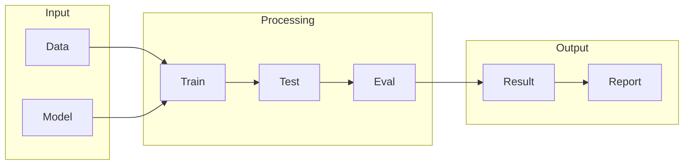

# TensorFlow

## What is TensorFlow
TensorFlow is a software framework designed to simplify the process of building and training machine learning models, particularly those involving complex neural networks. It's primarily used for tasks related to machine learning and deep learning. Before TensorFlow, implementing these networks was cumbersome, requiring a lot of manual coding and math. With TensorFlow, the goal is to streamline this process, making it more efficient and less error-prone.

## What problem it solves
The main problem TensorFlow solves is the complexity of neural networks. Before its existence, researchers and developers had to write custom code for each project, which was time-consuming and prone to errors. Libraries like NumPy helped with numerical computations but weren't specifically designed for neural networks. TensorFlow automates the process of building and training neural networks, simplifying the workflow and reducing the need for manual coding.

## How it works internally
Internally, TensorFlow works by representing workflows as graphs, also known as computation graphs or data flow graphs. These graphs are composed of nodes connected by edges, where each node represents an operation (like matrix multiplication or activation functions), and the edges represent the flow of data between these operations. Nodes are the basic building blocks of the computation graph, each having inputs, outputs, and an operation that produces the outputs. For example, a node might perform matrix multiplication, taking two input tensors and producing an output tensor.

## Workflow overview
The workflow in TensorFlow can be visualized using the following diagram:

This diagram illustrates the basic flow from input (data and model) through processing (training, testing, evaluation) to output (results and reports). TensorFlow manages this workflow, from building the computation graph to executing it in a session, which handles resource allocation, memory management, and error handling.

## Step by step execution flow
The execution flow in TensorFlow involves several steps:
- Building the computation graph by creating nodes and edges that represent operations and data flow.
- Feeding inputs into the graph, which then performs operations based on the nodes.
- Passing outputs from each node to the next node in the graph, following the edges.
- Continuing this process until the final output of the graph is produced.
TensorFlow also supports conditional operations and control flow, allowing for more complex logic and decision-making within the computation graph.

## Real world use cases
TensorFlow has numerous real-world applications:
1. **Google Photos**: TensorFlow is used to identify objects and scenes within images, automatically categorizing and tagging them.
2. **Self-driving cars**: TensorFlow processes sensor data to detect and track objects, controlling the car's movements and navigation.
3. **Medical imaging analysis**: TensorFlow models are trained on medical images to detect diseases like cancer, providing diagnoses based on patterns and anomalies.

## Limitations and trade-offs
While TensorFlow simplifies the process of building and training neural networks, it's not without its limitations. The complexity of the computation graph can still be challenging to manage, especially for large models. Additionally, the automation provided by TensorFlow can sometimes make it difficult to understand the underlying mathematics and logic of the models, potentially leading to a lack of transparency in the decision-making process of the models.

## Practical closing thoughts
 TensorFlow is a powerful tool for machine learning and deep learning tasks, simplifying the process of building and training complex neural networks. By understanding how TensorFlow works internally and its workflow, developers can more effectively leverage its capabilities. While it has its limitations, TensorFlow remains a fundamental component in the toolkit of any machine learning or deep learning practitioner, offering a practical solution to the complexities of neural network implementation.