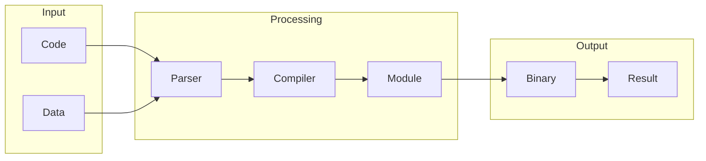

# WebAssembly

## What is WebAssembly
WebAssembly, often abbreviated as WASM, is a binary instruction format that allows code written in languages like C, C++, and Rust to be executed in web browsers. This means developers can use their preferred languages and still have their code run on the web, which is a significant improvement over the limitations of JavaScript. At its core, WebAssembly provides a platform-agnostic, secure way to run code in browsers.

## What problem it solves
The primary issue that WebAssembly addresses is the limitations of JavaScript, the primary language of the web, when it comes to high-performance computations or complex algorithms. Before WebAssembly, if you wanted to run code in a browser, you had to use JavaScript or plug-ins like Flash, which had security issues. Automation was handled using JavaScript, which was sufficient for simple tasks but struggled with complex computations. Developers had to use workarounds like compiling code to JavaScript or using native plug-ins, which were cumbersome and insecure.

## How it works internally
Internally, WebAssembly works by allowing code written in languages like C, C++, and Rust to be compiled into a binary format that can be executed by web browsers. This compilation process involves several steps, including parsing, compiling, and module creation. The resulting binary code is platform-agnostic, meaning it can run on any device that supports WebAssembly, without the need for recompilation.

## Workflow overview
A workflow in the context of WebAssembly and automation tools like n8n is a series of automated tasks that are executed in a specific order. It is defined by a directed graph of nodes, where each node represents a specific task or operation. The workflow can include triggers, which initiate the execution of the workflow, and nodes, which perform specific functions like sending an email or making an API request. The following diagram illustrates the basic flow of a WebAssembly workflow:

This diagram shows the input of code and data, the processing steps of parsing, compiling, and module creation, and the output of binary code and results.

## Step by step execution flow
The execution flow of a WebAssembly workflow in n8n involves several steps:
1. **Trigger Activation**: A trigger is activated, either by a schedule or an external event. This activation sends a signal to the n8n engine to start executing the workflow.
2. **Node Execution**: The n8n engine starts executing the first node in the workflow. Each node performs its specific function, such as sending an email or making an API request.
3. **Data Passing**: The output of each node is passed to the next node in the workflow. This allows data to be transformed and processed as it flows through the workflow.
4. **Conditional Logic**: The workflow can include conditional logic, such as if-else statements or switch statements, to control the flow of execution. This logic is evaluated based on the output of previous nodes.
5. **Looping**: Workflows can also include loops, which allow nodes to be executed repeatedly until a certain condition is met.
6. **Error Handling**: If a node fails during execution, the workflow can be configured to handle the error. This can include retrying the node, sending an error notification, or terminating the workflow.

## Real world use cases
WebAssembly has several real-world use cases, including:
1. **Web-based video editing**: Companies like Adobe use WebAssembly to run video editing software in web browsers. This involves compiling the video editing application into WebAssembly code, which is then executed by the browser.
2. **Online gaming**: Game developers use WebAssembly to deploy games that run in web browsers, allowing users to play without installing native applications.
3. **Financial modeling**: Financial institutions use WebAssembly to run complex financial models in web applications, allowing users to interact with the models and view results in real-time.

## Limitations and trade-offs
While WebAssembly provides a platform-agnostic, secure way to run code in browsers, it also has some limitations and trade-offs. For example, WebAssembly code must be compiled into a binary format, which can be time-consuming and may require significant resources. Additionally, WebAssembly is still a relatively new technology, and some browsers may not support it fully.

## Practical closing thoughts
 WebAssembly is a powerful technology that allows code written in languages like C, C++, and Rust to be executed in web browsers. It provides a platform-agnostic, secure way to run code in browsers, which is a significant improvement over the limitations of JavaScript. By understanding how WebAssembly works and its real-world use cases, developers can take advantage of its benefits and create more efficient, secure, and scalable web applications. As the technology continues to evolve, we can expect to see even more innovative use cases and applications of WebAssembly in the future.