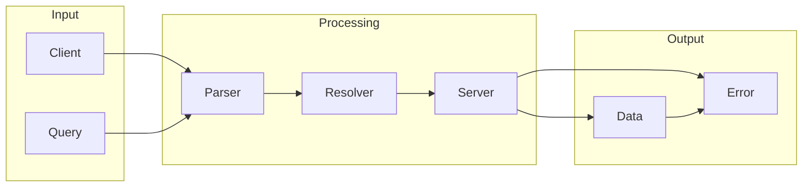

# GraphQL

## What is GraphQL
GraphQL is a query language for APIs that allows for more flexibility and efficiency in data retrieval. It was created to address the limitations of traditional REST APIs, which often resulted in over-fetching or under-fetching of data. In essence, GraphQL provides a way to specify exactly what data is needed, reducing the amount of unnecessary data transferred and improving application performance.

## What problem it solves
The main problem that GraphQL solves is the issue of over-fetching and under-fetching data in traditional REST APIs. When using REST, a client would often request more data than needed, or not enough, leading to multiple requests and slowing down the application. GraphQL addresses this issue by allowing clients to specify exactly what data they need, reducing the amount of unnecessary data transferred and improving application performance. This is particularly useful in modern applications where data is often retrieved from multiple sources and needs to be processed and displayed quickly.

## How it works internally
From an engineering perspective, GraphQL works by parsing a query into an abstract syntax tree (AST), which represents the structure of the query, including the fields, arguments, and types. The AST is then executed, and the workflow nodes are executed in the correct order to retrieve the requested data. The data is then serialized into a JSON response, which is returned to the client. Throughout the execution of the workflow, the GraphQL schema is validated to ensure that the query or mutation is valid and that the types and fields are correct. If any validation errors occur, an error response is returned to the client.

## Workflow overview
A workflow in the context of GraphQL can be thought of as a series of automated tasks that are connected together to achieve a specific goal. The workflow starts with a trigger, such as a GraphQL query or mutation, which activates the execution of the workflow. The workflow then executes a series of nodes that retrieve data from a database or perform other tasks, and finally, returns the response to the client. The following diagram illustrates the workflow overview:

This diagram shows the input, processing, and output stages of the workflow. The client sends a query to the parser, which parses the query into an AST. The resolver then executes the AST, retrieving the requested data from the server. The server returns the data to the client, or an error if any validation errors occur.

## Step by step execution flow
The step-by-step execution flow of a workflow in GraphQL can be broken down into several stages. First, the trigger is activated, which starts the execution of the workflow. The first node in the workflow is then executed, which performs a specific task, such as sending an HTTP request or querying a database. The output of the first node is then passed to the next node in the workflow as input. This data flow continues from node to node, with each node processing the input data and producing output. Logic and conditions are evaluated at specific nodes, such as the IF node or the Switch node, which determine the flow of execution. If a node fails or encounters an error, the workflow execution is redirected to an error handling path.

## Real world use cases
GraphQL is used in several real-world applications, including GitHub's API, Pinterest's mobile app, and Shopify's storefront API. For example, GitHub's API uses GraphQL to allow developers to query specific data about repositories, such as the number of open issues or the list of collaborators. When a query is made, GitHub's server resolves the request by fetching the required data from its database. The requested data is then returned to the developer in a JSON format. Similarly, Pinterest's mobile app uses GraphQL to fetch data about user profiles, including their pins, boards, and followers. When a user opens their profile page, the app sends a GraphQL query to Pinterest's server, which then retrieves the required data from its database and returns it to the app.

## Limitations and trade-offs
While GraphQL provides several benefits, including improved performance and flexibility, it also has some limitations and trade-offs. One of the main limitations is that GraphQL requires a significant amount of upfront planning and design, including defining the schema and resolvers. Additionally, GraphQL can be more complex to implement and maintain than traditional REST APIs, particularly for large and complex applications. Furthermore, GraphQL may not be suitable for all use cases, such as simple CRUD operations, where a traditional REST API may be more efficient.

## Practical closing thoughts
 GraphQL is a powerful query language for APIs that provides several benefits, including improved performance and flexibility. However, it also requires significant upfront planning and design, and may not be suitable for all use cases. When considering using GraphQL, it's essential to weigh the benefits and trade-offs and determine whether it's the right fit for your application. Additionally, it's crucial to have a clear understanding of the workflow and execution flow, including the parsing, resolving, and validation stages. By doing so, you can effectively leverage GraphQL to improve the performance and efficiency of your application.