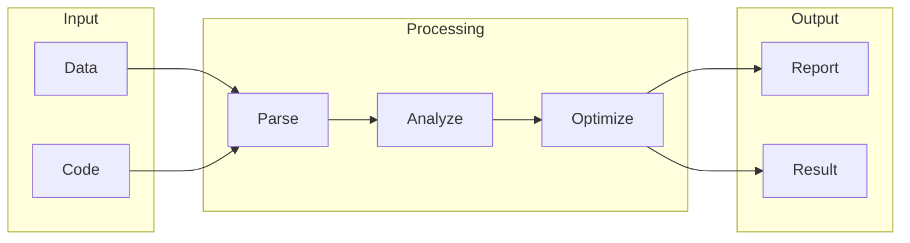

# Faircode

## What is Faircode
Faircode is a tool designed to ensure fairness and transparency in code reviews. It aims to address the biases and inconsistencies that can occur during manual code reviews. Before tools like Faircode, code reviews were done manually by humans, which can be time-consuming and prone to errors. The goal of Faircode is to provide a more objective and systematic approach to code reviews.

## What problem it solves
The problem that led to the creation of Faircode is the lack of fairness and consistency in manual code reviews. Developers had to rely on their own judgment and experience to review code, which can lead to subjective decisions. This could result in inconsistent feedback, delayed reviews, and even conflicts among team members. Faircode aims to fill this gap by providing a more objective and systematic approach to code reviews.

## How it works internally
Faircode works internally using a workflow-based system. In this system, a workflow is a series of automated tasks that are executed in a specific order. It's essentially a flowchart of actions that are triggered by an event or a schedule. A workflow in Faircode consists of multiple nodes, which are the building blocks of the workflow. Each node represents a specific task, such as sending an email, making an API request, or manipulating data. Nodes can be connected to each other to create a flow of tasks.

## Workflow overview
The workflow in Faircode can be visualized using the following diagram:

This diagram shows the overall flow of the workflow, from input to output. The input stage involves receiving data and code, which are then parsed and analyzed. The analyzed data is then optimized, and the results are generated in the form of a report and a result.

## Step by step execution flow
Here's how the execution flows step by step:
1. **Trigger Activation**: The trigger is activated, which starts the workflow execution.
2. **First Node Execution**: The first node in the workflow is executed. This node performs a specific task, such as retrieving data from an API.
3. **Node Output**: The first node produces output data, which is then passed to the next node in the workflow.
4. **Next Node Execution**: The next node in the workflow is executed, using the output data from the previous node as input.
5. **Node Connection**: Each node is connected to the next node through an edge, which defines the flow of data between nodes.
6. **Conditional Logic**: If a node has conditional logic (e.g., an if-else statement), it is evaluated at this stage. The node will execute different paths based on the condition.
The workflow continues executing node by node, with each node performing its task and producing output data for the next node, until the end of the workflow is reached.

## Real world use cases
Faircode has several real-world use cases, including:
* Auditing software development projects: Faircode is used to review and analyze code contributions to ensure they meet the agreed-upon standards and requirements.
* Resolving coding disputes: Faircode helps resolve disputes between developers by analyzing code submissions and determining the extent of each contributor's work.
* Calculating royalties for open-source projects: Faircode is used to track and calculate the contributions made by each developer to an open-source project.

## Limitations and trade-offs
While Faircode provides a more objective and systematic approach to code reviews, it is not without its limitations and trade-offs. For example, Faircode may not be able to fully replace human judgment and experience in code reviews. Additionally, Faircode may require significant setup and configuration to work effectively.

## Practical closing thoughts
 Faircode is a tool that provides a more objective and systematic approach to code reviews. It works internally using a workflow-based system and can be used in a variety of real-world scenarios. While it has its limitations and trade-offs, Faircode can be a valuable tool for developers and teams looking to improve the fairness and consistency of their code reviews. By understanding how Faircode works and its potential use cases, developers can make informed decisions about whether to use it in their own projects.