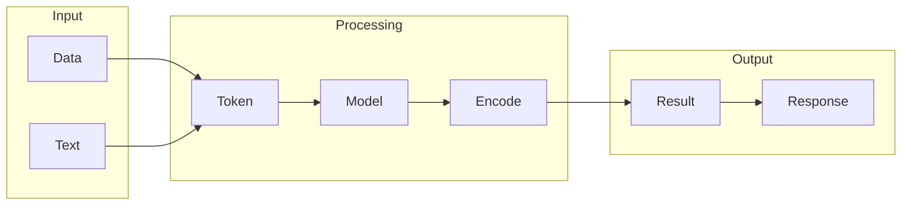

# LLaMA

## What is LLaMA
LLaMA is a large language model designed to process and understand vast amounts of text data. The primary goal of LLaMA is to provide a scalable solution to the limitations of human-based text analysis, which has become increasingly impractical due to the sheer volume of text data available. By leveraging advanced machine learning algorithms, LLaMA can learn from large datasets and generate human-like text, making it a valuable tool for various applications.

## What problem it solves
The problem that LLaMA solves is the scalability issue of human-based text analysis. As the amount of text data grows, it becomes impossible for humans to manually process and understand it all. Before the development of large language models like LLaMA, automation was handled using rule-based systems or simple machine learning models, which were limited in their ability to understand nuances and context. These systems were often brittle and prone to errors, making them less effective than LLaMA. By providing a more advanced and flexible text analysis tool, LLaMA enables users to process and understand large volumes of text data more efficiently.

## How it works internally
To understand how LLaMA works internally, let's consider a similar system, n8n, which is a workflow automation tool. n8n's workflow consists of a series of automated tasks executed in a specific order, defined by a flowchart that outlines how data is processed and transformed. The building blocks of this workflow are nodes, which represent specific tasks or operations, such as reading data from a database or making an API call. These nodes can be connected to create a workflow, and different types of nodes, including trigger nodes, action nodes, and conditional nodes, are used to control the flow of the workflow. While LLaMA's internal workings are likely to be similar, the specific nodes and triggers might differ. For example, LLaMA might use nodes to perform tasks such as receiving input text, tokenizing the text, using a language model to generate text, and post-processing the generated text.

## Workflow overview
The workflow of a system like LLaMA can be visualized using a diagram. Here's an example diagram that illustrates the workflow:

This diagram shows the input stage, where data and text are received, followed by the processing stage, where the text is tokenized, and a language model is used to generate text. The output stage then takes the generated text and returns it as a result. This diagram provides a simplified overview of the workflow, and the actual implementation might vary depending on the specific requirements of the system.

## Step by step execution flow
The execution flow of LLaMA is step-by-step, with each node performing its specific task and passing the output to the next node in the sequence. Here's a high-level overview of the execution flow:
- The workflow is triggered by a trigger node, which sets the execution in motion.
- The trigger node passes data to the next node in the sequence, which could be a text input node that receives the input text from the user.
- The text input node then passes the input text to a tokenization node, which breaks the text into individual tokens or words.
- The tokenization node then passes the tokens to a language model node, which uses a language model to generate text based on the input tokens.
- The language model node then passes the generated text to a post-processing node, which performs additional processing on the text, such as spell-checking or fluency evaluation.
- Finally, the post-processing node passes the final generated text to an output node, which returns the text to the user.
This execution flow is similar to the workflow in n8n, with each node performing its specific task and passing the output to the next node in the sequence.

## Real world use cases
LLaMA has various real-world use cases, including:
- A customer support team using LLaMA to generate initial responses to common customer inquiries, which are then reviewed and edited by human support agents before being sent to customers.
- A language translation company utilizing LLaMA to translate large volumes of text from one language to another, with human translators then reviewing and refining the translations to ensure accuracy.
- A content creation team employing LLaMA to generate outlines and rough drafts of articles, blog posts, and other written content, which are then expanded upon and rewritten by human writers.
These use cases demonstrate the versatility of LLaMA and its potential to automate various text-related tasks, freeing up human resources to focus on more complex and creative tasks.

## Limitations and trade-offs
While LLaMA provides a powerful solution for text analysis and generation, it also has limitations and trade-offs. For example:
- LLaMA requires large amounts of training data to learn and improve, which can be time-consuming and resource-intensive.
- The model may not always understand nuances and context, leading to errors or inaccuracies in the generated text.
- LLaMA may not be suitable for tasks that require a high level of creativity or originality, as it is limited to generating text based on patterns and structures learned from the training data.
These limitations and trade-offs should be carefully considered when using LLaMA or similar language models, and the specific use case and requirements should be evaluated to determine the best approach.

## Practical closing thoughts
 LLaMA is a powerful tool for text analysis and generation, with various real-world use cases and applications. By understanding how LLaMA works internally and its limitations and trade-offs, users can make informed decisions about when and how to use the model. As the field of natural language processing continues to evolve, it's likely that LLaMA and similar models will become even more advanced and versatile, enabling users to automate complex text-related tasks and focus on higher-level creative and strategic work. As a practical takeaway, it's essential to approach LLaMA and similar models with a clear understanding of their capabilities and limitations, and to carefully evaluate the specific use case and requirements before implementing the model.