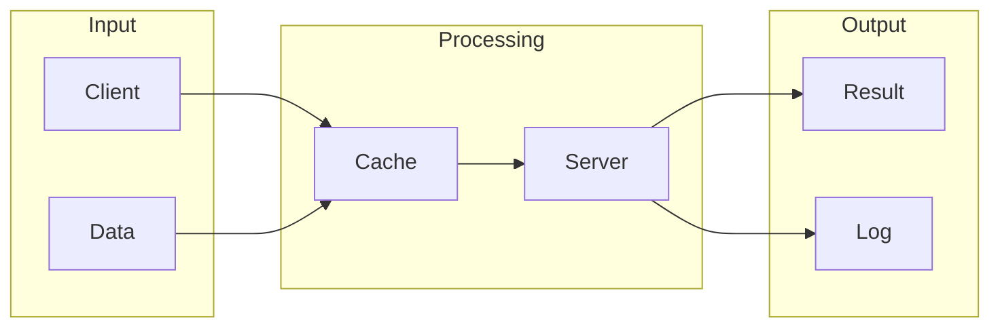

# Redis

## What is Redis
Redis is an in-memory data store that can be used as a database, message broker, or cache layer. It provides a fast, in-memory layer that can sit between applications and databases, making it easier to handle high-performance, real-time data. This is necessary because traditional databases can be slow and weren't designed to handle high-performance, real-time data.

## What problem it solves
Traditional databases are mostly disk-based, which means data has to be written to and read from disks. This process is slow compared to storing data in memory. Before tools like Redis, developers had to implement caching mechanisms or use tricky workarounds to improve performance. It was cumbersome and error-prone. Redis was created to fill this gap, providing a fast, in-memory layer that can handle high-performance, real-time data.

## How it works internally
Redis uses a client-server architecture, where clients send commands to the Redis server, and the server executes the commands and returns the results. When a client sends a command to the Redis server, the command is parsed to determine the operation to be performed. The parsed command is then executed by the Redis server, which performs the necessary operations on the data stored in hash tables. Each hash table contains a set of key-value pairs, where the key is unique and the value is the associated data. When a key-value pair is written to Redis, the key is hashed and the resulting hash is used to determine the location of the value in the hash table.

## Workflow overview
The workflow of Redis can be visualized using the following diagram:

This diagram shows the basic flow of data in Redis, from the client and data input, to the processing stage where the data is stored in the cache and server, and finally to the output stage where the result is returned and logged.

## Step by step execution flow
Here is a step-by-step explanation of the execution flow in Redis:
- A client sends a command to the Redis server.
- The command is parsed to determine the operation to be performed.
- The parsed command is then executed by the Redis server, which performs the necessary operations on the data stored in hash tables.
- The data is stored in the main memory (RAM) for fast access and retrieval.
- The Redis server uses a snapshotting mechanism to persist the data to disk at regular intervals.
- The Redis server also uses an append-only file (AOF) mechanism to log all write operations to a file, allowing the data to be reconstructed in case of a failure.

## Real world use cases
Redis has several real-world use cases, including:
- Session management: Many websites use Redis to store user session data, such as login information and preferences.
- Leaderboard tracking: Online gaming platforms use Redis to track player scores and rankings in real-time.
- Job queuing: Companies like GitHub use Redis to manage job queues for tasks such as sending emails or processing images.

## Limitations and trade-offs
While Redis provides a fast and efficient way to handle high-performance, real-time data, it also has some limitations and trade-offs. For example, Redis uses a single-threaded architecture, which can limit its ability to handle a large number of concurrent connections. Additionally, Redis uses a memory allocation mechanism to manage the memory used by the Redis server, which can lead to memory eviction and removal of least recently used (LRU) items from the cache.

## Practical closing thoughts
 Redis is a powerful tool for handling high-performance, real-time data. Its in-memory data store and client-server architecture make it an ideal solution for applications that require fast data access and retrieval. While it has some limitations and trade-offs, Redis is a widely used and well-established technology that can be used in a variety of real-world use cases. By understanding how Redis works internally and its workflow overview, developers can use Redis to build fast, efficient, and scalable applications.