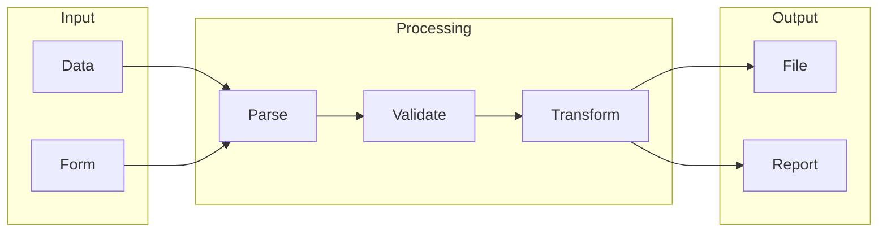

# Dify

## What is Dify
Dify is a tool designed to simplify data integration, helping to connect different data sources and automate workflows. At its core, Dify aims to provide a more efficient and user-friendly way to manage and automate data integration tasks. By understanding what Dify is, we can begin to see how it addresses the complexities of data integration and workflow management.

## What problem it solves
The problem Dify solves is the manual effort required to integrate and manage data from various sources. Before tools like Dify, data integration was a tedious and time-consuming process, prone to errors. Automation was often handled through manual scripting, custom coding, or using generic automation tools that weren't specifically designed for data integration. This approach required a lot of technical expertise and was difficult to maintain and scale. Dify emerged to address this pain point, providing a more efficient and scalable way to automate data integration and workflow management.

## How it works internally
From an engineering perspective, Dify works by creating a series of steps that are executed in a specific order, essentially a graph that represents the flow of data and execution between different components. Within a workflow, individual steps are represented as nodes, each performing a specific function, such as fetching data from an API or sending an email. These nodes are the building blocks of a workflow and can be connected to each other to create a flow of execution. A trigger, a special type of node, initiates the execution of a workflow, which can be scheduled to run at specific times or be event-driven.

## Workflow overview
The workflow overview can be visualized using a diagram, which illustrates the flow of data and execution between different components.

This diagram shows the input stage, where data is collected, followed by the processing stage, where the data is parsed, validated, and transformed. Finally, the output stage produces a file or report. By understanding this workflow, we can see how Dify manages data integration and automation.

## Step by step execution flow
The execution flow in Dify begins with a trigger, which initiates the execution of a workflow. The workflow execution flows from the trigger node to the next connected node, and then to the next, and so on. Each node executes its specific function, and the output of one node is passed as input to the next node. Logic and conditions are evaluated within nodes using specific functions or expressions. For example, an IF node can evaluate a condition and route the execution flow to different nodes based on the result. As the workflow executes, data flows between nodes, allowing for complex data processing and transformation. If an error occurs during the execution of a node, the workflow can be configured to handle the error, such as retrying the node or terminating the workflow execution.

## Real world use cases
While Dify is not a well-known tool, we can imagine hypothetical use cases for a tool with similar functionality. For instance, data analysts might use Dify to import data from various sources, clean and preprocess the data, and then transform and format it into a suitable structure for further analysis. Researchers could utilize Dify to collect and organize data from different experiments, process and filter the data to remove inconsistencies or errors, and then use the cleaned data for statistical analysis. Business users might employ Dify to automate tasks such as data migration and synchronization between different systems, reducing manual errors and saving time.

## Limitations and trade-offs
While Dify provides a more efficient and user-friendly way to automate data integration and workflow management, it is not without its limitations and trade-offs. For example, the use of a graphical interface to create workflows may limit the complexity of the workflows that can be created. Additionally, the reliance on pre-built nodes and functions may limit the customization options available to users. Furthermore, the error handling mechanisms may not be robust enough to handle all possible error scenarios. By understanding these limitations and trade-offs, we can better evaluate the suitability of Dify for our specific use cases.

## Practical closing thoughts
 Dify is a tool that simplifies data integration and automates workflows by providing a user-friendly interface to create and manage workflows. By understanding how Dify works internally, its workflow overview, and its step-by-step execution flow, we can appreciate the complexity and power of this tool. While it has its limitations and trade-offs, Dify can be a valuable asset for data analysts, researchers, and business users who need to automate data integration and workflow management tasks. As with any tool, it is essential to carefully evaluate its suitability for our specific use cases and to consider its limitations and trade-offs before adopting it. By doing so, we can harness the power of Dify to streamline our data integration and workflow management tasks and improve our overall productivity.