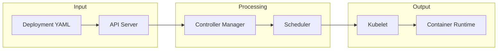

# Kubernetes

## What is Kubernetes
Kubernetes is a container orchestration system designed to automate the deployment, scaling, and management of containerized applications. It was originally developed by Google and is now maintained by the Cloud Native Computing Foundation (CNCF). In essence, Kubernetes provides a way to manage and orchestrate containerized applications, making it easier to deploy, scale, and maintain complex applications.

## What problem it solves
As applications grow, they become increasingly complex, with multiple services, dependencies, and instances to manage. Before tools like Kubernetes, managing these applications was done manually or with custom scripts, which didn't scale well. As the application grew, the scripts became complex and difficult to maintain. Kubernetes solves this problem by providing a way to automate deployment, scaling, and management of containerized applications, making it easier to manage complex applications.

## How it works internally
To understand how Kubernetes works internally, let's look at its key components. These include pods, which are the basic execution unit in Kubernetes and can contain one or more containers. ReplicaSets ensure a specified number of replicas are running at any given time, while deployments manage rollouts and rollbacks of pods and ReplicaSets. Services provide a network identity and load balancing for accessing pods, and persistent volumes provide persistent storage for data that needs to be preserved across pod restarts. 

## Workflow overview
The workflow in Kubernetes involves several steps and components working together. Here's a high-level overview of the workflow:

This diagram illustrates the main components involved in the workflow and how they interact with each other.

## Step by step execution flow
Here's a step-by-step explanation of the execution flow:
1. **Deployment Creation**: A user creates a deployment YAML file describing the desired state of the application.
2. **API Server**: The user submits this YAML file to the Kubernetes API server.
3. **etcd**: The API server stores the deployment configuration in etcd, a distributed key-value store.
4. **Controller Manager**: The controller manager watches etcd for changes to the desired state and instructs the scheduler to deploy the pods.
5. **Scheduler**: The scheduler determines which node in the cluster is best suited to run the pod based on factors like available resources and affinity rules.
6. **Kubelet**: Once a pod is scheduled to a node, the kubelet creates and manages the pod's containers.
7. **Container Runtime**: The container runtime creates the containers within the pod.

## Real world use cases
Kubernetes has many real-world use cases. For example:
* Online retailers use Kubernetes to deploy and manage their e-commerce platforms, which consist of multiple microservices.
* Financial institutions use Kubernetes to run their trading platforms, which require low-latency and high-availability.
* Media companies use Kubernetes to process and distribute video content, which involves transcoding, encoding, and streaming.

## Limitations and trade-offs
While Kubernetes provides many benefits, it also has some limitations and trade-offs. For example, it can be complex to set up and manage, especially for large-scale applications. Additionally, it requires significant resources and expertise to maintain and optimize. However, these trade-offs are often worth it, given the benefits of automated deployment, scaling, and management of containerized applications.

## Practical closing thoughts
 Kubernetes is a powerful tool for managing and orchestrating containerized applications. By understanding how it works internally and its various components, you can better appreciate its benefits and limitations. Whether you're an experienced engineer or just starting out, Kubernetes is definitely worth exploring. With its ability to automate deployment, scaling, and management of containerized applications, it can help you build and maintain complex applications with ease.