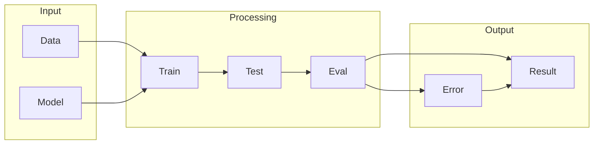

# PyTorch

## What is PyTorch
PyTorch is a machine learning library that simplifies the process of building and training neural networks. It provides a high-level interface for building and training neural networks, automating the computation of gradients and optimization. This allows users to focus on model architecture and data, making it easier to build and experiment with different models. At its core, PyTorch is designed to make building machine learning models easier, which is essential in machine learning research and development.

## What problem it solves
The problem that led to the creation of PyTorch is the complexity of neural networks. As data grows, manual computation becomes impractical. Before PyTorch, people used lower-level libraries or wrote custom code, which was time-consuming and error-prone. Automation was handled through manual implementation of optimization algorithms and gradient descent, requiring a deep understanding of linear algebra and calculus. PyTorch solves this problem by providing a high-level interface that automates the computation of gradients and optimization, making it easier to build and train neural networks.

## How it works internally
To explain how PyTorch works internally, let's break down its components and workflow step by step. The process begins with the creation of tensors, which are multi-dimensional arrays used to represent inputs, outputs, and intermediate results. PyTorch's Autograd system is responsible for automatically computing gradients. When a tensor is created, it is assigned a flag that indicates whether it requires gradient computation. If the flag is set, the Autograd system records the operations performed on the tensor, creating a computation graph. The computation graph is a directed acyclic graph (DAG) that represents the sequence of operations performed on tensors. Each node in the graph corresponds to a tensor, and the edges represent the operations that produce or consume the tensors.

## Workflow overview
The workflow in PyTorch involves creating tensors, defining models using modules, and executing the forward and backward passes. The workflow is typically managed using PyTorch's `nn.Module` and `nn.Parameter` classes, which provide a structured way to define and execute neural networks. Here is a high-level overview of the workflow:

This diagram shows the basic workflow of PyTorch, from input to output.

## Step by step execution flow
The execution flow in PyTorch involves the following steps:
* Create tensors and register parameters with the Autograd system.
* Perform tensor operations, which update the computation graph.
* Execute the forward pass, which computes the output.
* Execute the backward pass, which computes the gradients.
* Update the model parameters using the optimizer.
This execution flow is the core of PyTorch's workflow, and it is what allows users to build and train neural networks efficiently.

## Real world use cases
PyTorch is used in a variety of real-world applications, including:
* Facebook uses PyTorch to power its facial recognition system, which involves training neural networks on large datasets of images to learn features and patterns.
* Researchers at the National Institutes of Health use PyTorch to develop and train models for medical image analysis, such as tumor segmentation and disease diagnosis.
* The self-driving car company, Uber ATG, uses PyTorch to develop and train models for perception tasks, such as object detection and tracking.
These use cases demonstrate the versatility and power of PyTorch in building and training neural networks.

## Limitations and trade-offs
While PyTorch is a powerful tool for building and training neural networks, it is not without its limitations and trade-offs. For example, PyTorch requires a significant amount of memory and computational resources, especially for large models and datasets. Additionally, PyTorch's dynamic computation graph can make it difficult to optimize and debug models. However, these limitations and trade-offs are a small price to pay for the ease of use and flexibility that PyTorch provides.

## Practical closing thoughts
 PyTorch is a powerful tool for building and training neural networks. Its high-level interface and automated computation of gradients and optimization make it an ideal choice for machine learning researchers and developers. While it has its limitations and trade-offs, PyTorch is a versatile and powerful tool that can be used in a variety of real-world applications. As with any tool, it is essential to understand how PyTorch works internally and to be aware of its limitations and trade-offs in order to use it effectively. With practice and experience, PyTorch can be a valuable addition to any machine learning toolkit.