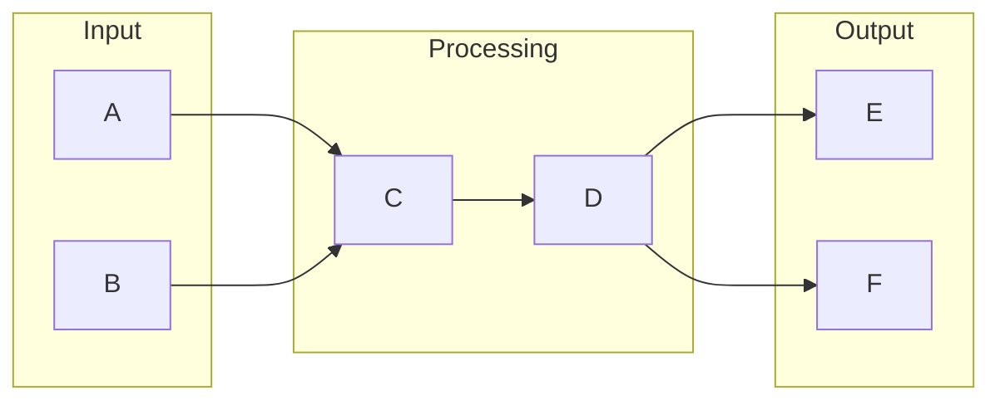

# Microservices

# 1. What is Microservices
Microservices is an architectural approach that breaks down a large application into smaller, independent services. Each service handles a specific task and communicates with other services as needed. This approach exists because of the limitations of traditional monolithic architecture, where large applications were built as a single, self-contained unit. Before Microservices, updating or modifying one part of the application without affecting the entire system was a challenge. 

# 2. What problem it solves
The main problem that Microservices solves is the issue of scalability and maintainability. Traditional monolithic architecture made it hard to update or modify one part of the application without affecting the entire system. This led to a huge bottleneck as applications grew. Microservices provides a more modular, flexible approach by breaking down an application into smaller, independent services. Each service can be updated, deployed, and scaled separately, making it easier to manage complexity and automate tasks.

# 3. How it works internally
Internally, Microservices works by breaking down an application into smaller, independent services. Each service handles a specific task and communicates with other services as needed. This approach allows for a more modular, flexible architecture. Automation is handled through a series of automated tasks that are executed in a specific order. These tasks are essentially a blueprint that defines how data flows through the system. 

# 4. Workflow overview
A workflow is a series of automated tasks that are executed in a specific order. It's essentially a blueprint that defines how data flows through the system. A workflow consists of multiple nodes, which are the building blocks of the workflow. 

This diagram shows a high-level overview of a workflow, with input nodes, processing nodes, and output nodes. The data flows from the input nodes, through the processing nodes, and finally to the output nodes.

# 5. Step by step execution flow
The execution flow begins when a trigger node activates the workflow. The flow proceeds step by step, with each node executing in sequence. Here's a high-level overview of the execution flow:
- The trigger node initiates the workflow and passes the input data to the next node.
- Each node processes the input data and performs its specific task.
- The output data from each node is passed to the next node in the sequence.
- The workflow continues until all nodes have been executed or a termination condition is met. 

# 6. Real world use cases
Microservices is used in various real-world applications. For example:
1. Online retail platforms like Amazon use microservices to manage their product catalog, order processing, and inventory management. Each service handles a specific task, such as updating product information or processing payments, and communicates with other services as needed.
2. Banking systems use microservices to handle different aspects of account management, such as transaction processing, account inquiries, and security authentication. Each microservice is responsible for a specific function, and they interact with each other to provide a complete banking service.
3. Transportation companies like Uber use microservices to manage their dispatch systems, handling tasks such as driver location tracking, ride matching, and fare calculation. Each microservice performs a specific function, such as updating driver locations or calculating optimal routes, and communicates with other services to coordinate the overall dispatch process.

# 7. Limitations and trade-offs
While Microservices provides a more modular, flexible approach to application development, it also has its limitations and trade-offs. For example, managing multiple services can be complex, and communication between services can be challenging. Additionally, debugging and testing microservices can be more difficult than monolithic applications. However, the benefits of Microservices, such as scalability and maintainability, often outweigh the limitations.

# 8. Practical closing thoughts
 Microservices is a powerful architectural approach that provides a more modular, flexible way to build applications. By breaking down an application into smaller, independent services, developers can create more scalable, maintainable systems. While Microservices has its limitations and trade-offs, the benefits it provides make it a popular choice for many developers. As the technology continues to evolve, it's likely that Microservices will play an increasingly important role in the development of complex applications.