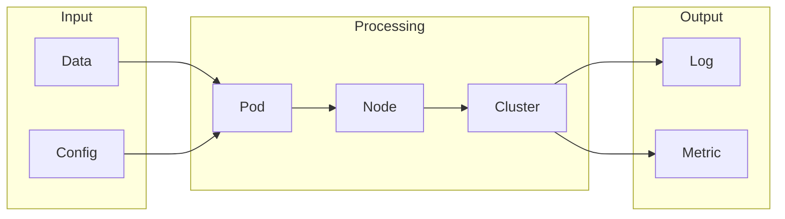

# Kubernetes

## What is Kubernetes
Kubernetes is a container orchestration system designed to manage and orchestrate containerized applications. It's a complex system, but at its core, it's a tool that helps you manage and scale your applications. Before diving into the details, let's take a step back and understand why Kubernetes exists in the first place.

## What problem it solves
As applications grew in complexity and scale, managing all the different components and services became a daunting task. Before Kubernetes, people were using virtual machines and manually configuring everything, which was time-consuming and prone to errors. Automation was handled through scripts and custom tools, but it was limited and not very scalable. This led to the development of tools like Kubernetes, which provides a more efficient and scalable way to manage complex applications.

## How it works internally
Let's break down how Kubernetes works internally from an engineering perspective. Kubernetes consists of several components, including pods, replication controllers, services, and persistent volumes. Pods are the basic execution unit in Kubernetes, comprising one or more containers. Replication controllers ensure a specified number of replicas of a pod are running at any given time. Services provide a network identity and load balancing for accessing pods. Persistent volumes provide persistent storage for data that needs to be preserved across pod restarts.

## Workflow overview
A workflow in Kubernetes can be thought of as a series of tasks that need to be executed in a specific order to achieve a desired outcome. The following diagram illustrates the workflow in Kubernetes:

This diagram shows the input, processing, and output stages of a Kubernetes workflow. The input stage involves data and configuration, which are used to create a pod. The pod is then executed on a node, which is part of a cluster. The output stage involves logging and metrics, which are used to monitor the workflow.

## Step by step execution flow
Here's a step-by-step explanation of how execution flows in Kubernetes:
1. **Trigger**: An event occurs that triggers the execution of a workflow. This event is sent to the Kubernetes API server.
2. **API Server**: The API server receives the event and determines what action to take. This is based on the configuration files and the current state of the system.
3. **Controller Manager**: The API server sends the event to the controller manager, which is responsible for managing the state of the system.
4. **Controller**: The controller manager determines which controller is responsible for handling the event and sends it to that controller.
5. **Controller Logic**: The controller evaluates the event and determines what action to take. This is based on the configuration files and the current state of the system.
6. **Kubelet**: The controller sends the action to the kubelet on the node where the pod is running.
7. **Pod Execution**: The kubelet executes the action on the pod, which can include things like starting a new container or deleting an existing one.

## Real world use cases
Kubernetes has many real-world use cases. For example:
* Online gaming platforms use Kubernetes to manage and scale game servers. When a new game is released, Kubernetes automatically provisions and configures the required servers to handle increased traffic.
* E-commerce companies utilize Kubernetes to deploy and manage their web applications during peak shopping seasons. Kubernetes creates and manages multiple replicas of the application to handle increased traffic, ensuring that the website remains available to customers.
* Financial institutions employ Kubernetes to manage their data processing and analytics workloads. Kubernetes schedules and runs batch processing jobs, such as data aggregation and reporting, on a cluster of machines.

## Limitations and trade-offs
While Kubernetes is a powerful tool, it's not without its limitations and trade-offs. For example, Kubernetes can be complex to set up and manage, especially for large-scale applications. Additionally, Kubernetes requires a significant amount of resources, including CPU, memory, and storage. However, the benefits of using Kubernetes far outweigh the costs, especially for applications that require high availability and scalability.

## Practical closing thoughts
 Kubernetes is a powerful tool for managing and orchestrating containerized applications. While it can be complex to set up and manage, the benefits of using Kubernetes far outweigh the costs. By understanding how Kubernetes works internally and how to use it effectively, you can build scalable and highly available applications that meet the needs of your users. Whether you're building a web application, a mobile application, or a data processing pipeline, Kubernetes is a tool that's worth considering. With its ability to manage and orchestrate containerized applications, Kubernetes is an essential tool for any developer or DevOps team.