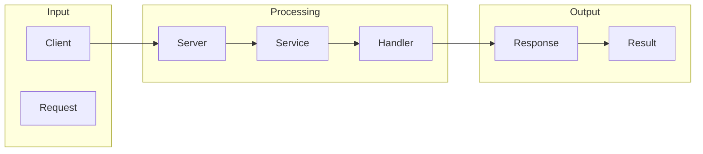

# gRPC

1. **What is gRPC**
gRPC is a high-performance RPC (Remote Procedure Call) framework that allows for efficient communication between services. It uses protocol buffers (protobuf) as the interface description language (IDL) to define the structure of the data exchanged between services. This framework is designed to simplify and streamline the process of handling RPCs, which has become increasingly important as systems grow more complex and microservices become more popular.

2. **What problem it solves**
The problem that forced people to build tools like gRPC was probably the need for faster, more efficient communication between services. Before gRPC, automation was handled using things like REST APIs, XML-RPC, or even SOAP. These methods worked, but they were often slow, verbose, and not very scalable. As a result, it was a real pain to set up and maintain these systems, especially as they grew in complexity. gRPC seems like an attempt to simplify and streamline this process, providing a more efficient and scalable way to handle RPCs.

3. **How it works internally**
To explain how gRPC works internally from an engineering perspective, let's break down its components and workflow step by step. gRPC uses protocol buffers (protobuf) as the interface description language (IDL) to define the structure of the data exchanged between services. This is done in a `.proto` file, which contains definitions for messages (data structures) and services (interfaces). When a client wants to call a remote procedure on a server, the client creates a request message according to the definition in the `.proto` file. The client then uses the gRPC stub (a local object that implements the service interface) to initiate the RPC call.

4. **Workflow overview**
The workflow of gRPC can be summarized as follows:
   - The client creates a request message according to the definition in the `.proto` file.
   - The client uses the gRPC stub to initiate the RPC call.
   - The gRPC stub serializes the request message into a binary format using protobuf.
   - The serialized request is sent over the network to the server.
   - The server receives the serialized request, deserializes it, and calls the corresponding method on the service implementation.
   - The service implementation processes the request and generates a response message.
   - The server serializes the response message into a binary format using protobuf.
   - The serialized response is sent back over the network to the client.
Here's a diagram that illustrates this workflow:

5. **Step by step execution flow**
The execution flow of gRPC can be broken down into several steps:
   - The client creates a request message according to the definition in the `.proto` file.
   - The client uses the gRPC stub to initiate the RPC call.
   - The gRPC stub serializes the request message into a binary format using protobuf.
   - The serialized request is sent over the network to the server.
   - The server receives the serialized request and deserializes it back into a request message using protobuf.
   - The server then calls the corresponding method on the service implementation, passing the deserialized request message as an argument.
   - The service implementation processes the request and generates a response message.
   - The server serializes the response message into a binary format using protobuf.
   - The serialized response is sent back over the network to the client.
   - The client receives the response, deserializes it, and returns it to the application.

6. **Real world use cases**
gRPC has several real-world use cases, including:
   - Google uses gRPC for its Stubby service, which handles authentication and authorization for various internal services.
   - Netflix utilizes gRPC for its internal service communication, particularly for its content delivery network.
   - CoreOS uses gRPC for its etcd distributed key-value store, which provides a reliable way to store and retrieve data across a cluster of machines.
These use cases demonstrate the versatility and efficiency of gRPC in handling RPCs in complex systems.

7. **Limitations and trade-offs**
While gRPC provides several benefits, it also has some limitations and trade-offs. For example:
   - gRPC requires a good understanding of protocol buffers (protobuf) and the `.proto` file format.
   - gRPC is designed for high-performance and low-latency communication, but it may not be suitable for all types of applications.
   - gRPC has a steep learning curve, especially for developers who are not familiar with RPCs or protocol buffers.
   - gRPC is not as widely adopted as some other RPC frameworks, which can make it harder to find resources and support.

8. **Practical closing thoughts**
 gRPC is a powerful and efficient RPC framework that can simplify and streamline the process of handling RPCs in complex systems. While it has some limitations and trade-offs, gRPC provides several benefits, including high-performance and low-latency communication, scalability, and reliability. As systems continue to grow in complexity and microservices become more popular, gRPC is likely to become an increasingly important tool for developers and engineers. By understanding how gRPC works and its real-world use cases, developers can make informed decisions about when to use gRPC and how to get the most out of it.