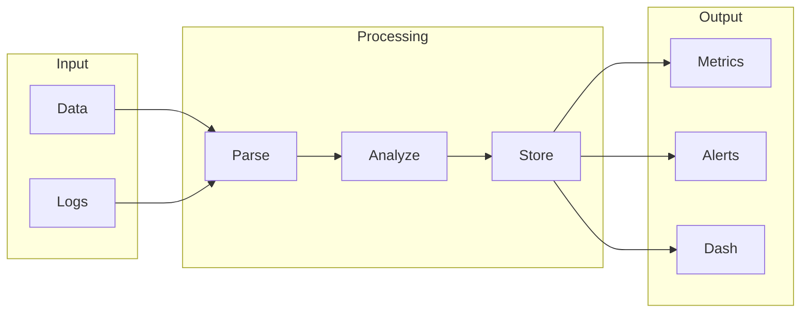

# Observability

# 1. What is Observability
Observability is a concept that has emerged as a solution to the complexities of modern distributed systems. With the rise of microservices and cloud-native applications, understanding what's happening inside these systems has become increasingly difficult. Observability aims to provide a way to gain insights into system behavior, performance, and user experience, allowing teams to respond quickly and effectively to issues. In essence, observability is about having a window into the system, making it possible to identify problems and optimize the system's behavior.

# 2. What problem it solves
Before observability, teams relied on logging and monitoring, but these methods had significant limitations. Logging required manual sifting through logs to find issues, which was time-consuming and prone to errors. Automation was handled through scripts and manual checks, but it was limited, and teams had to anticipate every possible issue and write code to handle it. If something unexpected happened, they were in the dark. Observability tools help fill this gap by providing insights into system performance, errors, and user experience, making it possible to identify and fix issues quickly.

# 3. How it works internally
To understand how observability works internally, let's break down the components and process step by step. In a workflow automation tool like n8n, a workflow is defined by the user through a graphical interface or by writing JSON code. This definition includes what tasks (or nodes) are to be executed and in what order. Nodes are the basic building blocks of a workflow, and each node represents a specific task or operation, such as sending an email or making an API call. Triggers are a special type of node that initiates the execution of a workflow, typically used to listen for specific events or changes.

# 4. Workflow overview
The workflow's execution is a step-by-step process, starting from the trigger node. The following diagram illustrates the workflow's execution flow:

This diagram shows the input data and logs being parsed, analyzed, and stored, and then used to generate metrics, alerts, and dashboards.

# 5. Step by step execution flow
The execution of a workflow in n8n happens step by step, starting from the trigger node. Here's how it flows:
- **Step 1**: The trigger node listens for the specified event. Once the event occurs, the trigger node is activated.
- **Step 2**: The activated trigger node then passes its output (if any) to the next connected node(s) in the workflow.
- **Step 3**: Each subsequent node in the workflow executes in sequence, with the output of one node becoming the input for the next node.
- **Step 4**: If a node in the workflow is a condition node, it evaluates the specified condition based on the input it received from the previous node.
- **Step 5**: The workflow continues through each path as defined by the user, executing nodes and evaluating conditions until all paths have been completed or until a termination condition is met.

# 6. Real world use cases
Observability has many real-world use cases, including:
1. **Monitoring application performance**: Observability tools can be used to track request latency, error rates, and system resource utilization, helping teams to identify bottlenecks and understand how the application behaves under stress.
2. **Troubleshooting microservices architecture**: Observability tools can help engineers to track the flow of requests between services and identify where errors occur, making it possible to diagnose issues quickly.
3. **Analyzing user behavior**: Observability tools can be used to collect data on how users interact with an application, including screen navigation, button clicks, and error messages, helping teams to understand user behavior and optimize the application's workflow.

# 7. Limitations and trade-offs
While observability provides many benefits, it's not without limitations and trade-offs. Implementing observability tools can require significant resources and investment, and the complexity of the system can make it difficult to interpret the data. Additionally, observability tools can generate a large amount of data, which can be overwhelming and require significant storage and processing resources.

# 8. Practical closing thoughts
 observability is a powerful tool for understanding and optimizing complex systems. By providing insights into system behavior, performance, and user experience, observability tools can help teams to identify and fix issues quickly, improving the overall reliability and efficiency of the system. While there are limitations and trade-offs to consider, the benefits of observability make it a worthwhile investment for any organization looking to improve their system's performance and reliability. As systems continue to evolve and become more complex, the importance of observability will only continue to grow, making it an essential tool for any engineer or organization looking to stay ahead of the curve.