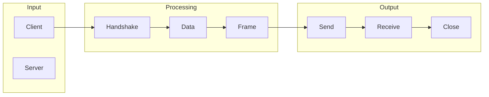

# WebSocket protocol

## What is WebSocket protocol
The WebSocket protocol is a bi-directional, real-time communication protocol that allows a client, usually a web browser, to establish a persistent, low-latency connection with a server over the web. It enables efficient, continuous communication between the client and server, facilitating applications such as live updates, live streaming, and real-time gaming. This protocol is designed to provide a more efficient way for real-time communication compared to traditional HTTP request-response models.

## What problem it solves
The problem that WebSocket solves is the limitation of the traditional HTTP request-response model, where communication was mostly one-way, with the client requesting data from the server and the server responding. However, there are scenarios where the server needs to push data to the client without being asked, such as live updates or real-time gaming. Before WebSocket, techniques like polling were used, where the client would continuously send requests to the server to check for updates, which was inefficient and could lead to delays.

## How it works internally
WebSocket protocol works by establishing a persistent connection between the client and server. This connection is established through a handshake process, which starts with an HTTP request from the client to the server, requesting to upgrade the connection to a WebSocket connection. Once the connection is established, data is sent in frames, each consisting of a header and payload. The header contains control bits, and the payload contains the actual data being sent. WebSocket messages can be fragmented into multiple frames, allowing for the efficient transmission of large messages.

## Workflow overview
The workflow of WebSocket protocol can be broken down into several steps, including the handshake process, data framing, message assembly, and error handling. 

This diagram shows the overall workflow of the WebSocket protocol, from the initial handshake to the sending and receiving of data.

## Step by step execution flow
The step-by-step execution flow of WebSocket protocol involves several steps. First, the client initiates a handshake process with the server by sending an HTTP request. The server then responds with an HTTP response indicating whether the upgrade is accepted. If accepted, the connection is established, and both the client and server can send data to each other at any time. Once the connection is established, data is sent in frames, and the receiver assembles these frames into the complete message. If an error occurs during the transmission of data, the receiving endpoint can send a close frame with a status code indicating the reason for the closure.

## Real world use cases
WebSocket protocol has several real-world use cases, including live updates in stock trading platforms, collaborative document editing, and real-time gaming. For example, in live updates in stock trading platforms, the server sends real-time updates on stock prices through a WebSocket connection. The client's browser receives these updates and updates the display accordingly. In collaborative document editing, a WebSocket connection is established between the client's browser and the server when a user opens a document. As users make changes to the document, their browsers send updates to the server, which then broadcasts these updates to all other connected clients.

## Limitations and trade-offs
WebSocket protocol has several limitations and trade-offs. One of the limitations is that it requires a persistent connection between the client and server, which can be resource-intensive. Additionally, WebSocket protocol is not suitable for all types of applications, such as those that require high levels of security or those that need to support a large number of concurrent connections. Furthermore, implementing WebSocket protocol can be complex, especially when it comes to handling errors and connection closures.

## Practical closing thoughts
 WebSocket protocol is a powerful tool for real-time communication between clients and servers. It provides a more efficient way for real-time communication compared to traditional HTTP request-response models. However, it also has several limitations and trade-offs that need to be considered when implementing it in real-world applications. By understanding how WebSocket protocol works and its limitations, developers can make informed decisions about when to use it and how to implement it effectively. With the right implementation, WebSocket protocol can provide a robust and efficient way for real-time communication, enabling a wide range of applications and use cases.