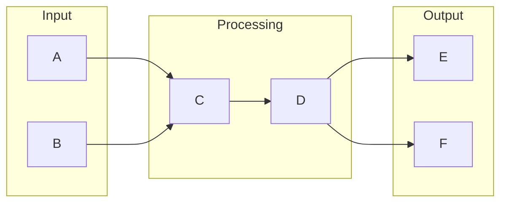

# Distributed Systems

## What is Distributed Systems
Distributed systems are a collection of independent computers that work together to appear as a single, cohesive system to the end user. They were created to solve the problems of high availability, scalability, and fault tolerance that arose as the internet grew and the number of users and data increased. Essentially, distributed systems are designed to handle large amounts of data and traffic by distributing tasks across multiple machines, allowing for more efficient processing and better fault tolerance.

## What problem it solves
Before distributed systems, automation was handled by mainframes or single servers that performed tasks sequentially. If one task failed, the whole system would go down, leading to downtime, data loss, and limited scalability. Distributed systems solve this problem by distributing tasks across multiple machines, allowing the system to continue operating even if one machine fails. This provides higher availability, scalability, and fault tolerance, making it possible to handle large amounts of data and traffic.

## How it works internally
From an engineering perspective, a distributed system can be thought of as a collection of independent computers that work together to achieve a common goal. One tool that can be used to build and manage distributed systems is n8n, a workflow automation tool. In n8n, a workflow is a series of tasks or nodes that are executed in a specific order, representing a process that can be automated. These nodes can be thought of as functions that take input data, perform some operation on it, and produce output data.

## Workflow overview
A workflow in n8n consists of multiple nodes that are connected together to form a flow of execution. The workflow can be triggered by various events, such as a schedule, a web hook, or a manual trigger. The nodes in the workflow can be thought of as building blocks, each performing a specific task or operation. The workflow can also include conditional logic, which determines the path that the workflow takes based on certain conditions.

This diagram shows a simple workflow with two input nodes, two processing nodes, and two output nodes. The workflow can be triggered by various events, and the nodes can be connected together to form a flow of execution.

## Step by step execution flow
Here is a step-by-step explanation of how a workflow is executed in n8n:
* The trigger listens for the specified event and triggers the workflow when the event occurs.
* The first node in the workflow is executed, taking input data, performing some operation on it, and producing output data.
* The output data from the first node is passed to the next node in the workflow.
* The next node in the workflow is executed, taking the output data from the previous node as input.
* Conditional logic is evaluated at this point, determining which path the workflow should take next.
* If the conditional logic evaluates to true, the workflow branches to the specified path. If it evaluates to false, the workflow continues to the next node.
* The workflow continues to execute nodes, passing data between them, until it reaches the end of the workflow.

## Real world use cases
Distributed systems have many real-world use cases, including:
* Google's search engine, which crawls and indexes web pages across a large number of machines.
* Online banking systems, which use distributed databases to store and manage customer account information across multiple locations.
* Amazon's e-commerce platform, which handles large volumes of customer orders and inventory updates by distributing tasks across multiple machines.

## Limitations and trade-offs
While distributed systems provide many benefits, they also have some limitations and trade-offs. For example, distributed systems can be more complex to design and manage than traditional systems, and they may require more resources and infrastructure to operate. Additionally, distributed systems may be more prone to errors and failures due to the increased complexity of the system.

## Practical closing thoughts
 distributed systems are a powerful tool for building scalable and fault-tolerant systems. By distributing tasks across multiple machines, distributed systems can handle large amounts of data and traffic, providing higher availability and better fault tolerance. While distributed systems have some limitations and trade-offs, they are an essential part of many modern systems, including search engines, online banking systems, and e-commerce platforms. As a developer or engineer, understanding how distributed systems work and how to design and manage them is crucial for building scalable and reliable systems.