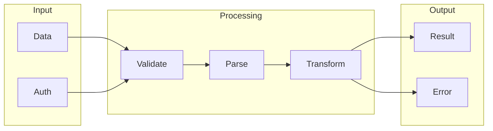

# API Design

## What is API Design
API Design exists to standardize and streamline the process of creating Application Programming Interfaces. It's like a blueprint for building APIs, providing a structured approach to ensure consistency and efficiency. This concept is essential in today's software development, as it helps alleviate the complexities and variability of APIs.

## What problem it solves
The primary problem that API Design solves is the complexity and variability of APIs. Before the introduction of API Design tools, APIs were built in a more ad-hoc manner, leading to inconsistencies and difficulties in maintenance and integration. This resulted in a cumbersome process that required a lot of manual effort, with issues in automation, version control, and documentation. API Design helps mitigate these issues by providing a set of guidelines to follow, making it easier to create, test, and maintain APIs.

## How it works internally
From an engineering perspective, an API design workflow can be broken down into several key components. These components include workflows, nodes, and triggers. A workflow represents the overall flow of data from start to finish, while nodes are the building blocks of a workflow, each performing a specific function. Triggers, on the other hand, initiate the execution of a workflow, either by a schedule or in response to an event. This structured approach allows for a more efficient and consistent API design process.

## Workflow overview
The workflow overview can be visualized using the following diagram:

This diagram illustrates the flow of data from input to output, with processing nodes in between. It provides a clear and concise representation of the API design workflow, making it easier to understand and implement.

## Step by step execution flow
The execution flow of an API design workflow can be broken down into several steps:
1. **Trigger Activation**: The trigger node is activated, either by a schedule or an event, starting the execution of the workflow.
2. **Node Execution**: The trigger node executes its function, which may involve fetching data or sending a request.
3. **Data Passing**: The data from the trigger node is passed to the next node in the workflow.
4. **Node Processing**: Each node in the workflow processes the data it receives from the previous node, involving transformations, filtering, or other operations.
5. **Logic and Conditions**: Logic and conditions are evaluated at each node, determining the flow of data and which nodes to execute next.
6. **Branching and Merging**: The workflow can branch out to multiple nodes or merge data from multiple nodes, allowing for complex logic and conditional flows.
7. **Error Handling**: If an error occurs during node execution, the workflow can be designed to handle the error, involving retrying the node, skipping to the next node, or terminating the workflow.

## Real world use cases
API Design has numerous real-world applications, including:
1. Online shopping platforms using APIs to connect with payment gateways, allowing customers to complete transactions.
2. Social media platforms integrating APIs with third-party services to enable users to share content across different platforms.
3. Logistics companies using APIs to connect with mapping services, optimizing routes for delivery trucks.

## Limitations and trade-offs
While API Design provides a structured approach to building APIs, it's essential to consider the limitations and trade-offs. These may include:
* Increased complexity in workflow design
* Potential performance issues with large workflows
* Limited support for certain programming languages or frameworks
* Steeper learning curve for developers without prior experience with API Design tools

## Practical closing thoughts
 API Design is a crucial aspect of software development, providing a standardized and streamlined approach to building APIs. By understanding how API Design works internally, developers can create more efficient and consistent APIs. The workflow overview and execution flow provide a clear representation of the API design process, making it easier to implement and maintain. While there are limitations and trade-offs to consider, the benefits of API Design make it an essential tool for any developer working with APIs.