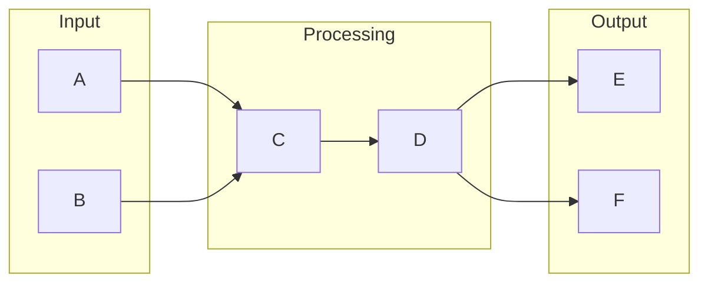

# Service Mesh

# 1. What is Service Mesh
A Service Mesh is a dedicated tool designed to manage and simplify communication between microservices in a distributed system. It provides a standardized way of handling service discovery, traffic management, and security between these microservices. Before the advent of Service Mesh, managing these aspects was a manual and error-prone process, which became increasingly complex as the number of microservices grew.

# 2. What problem it solves
The primary problem Service Mesh solves is the complexity of managing communication between microservices. Without a Service Mesh, teams would have to manually configure and manage each service, which is time-consuming and prone to errors. Automation was previously handled through scripts, manual configuration, or DIY solutions, which were cumbersome and not scalable. Service Mesh abstracts away this complexity, providing a unified way to manage service communication.

# 3. How it works internally
To understand how a Service Mesh works internally, let's consider a similar concept, a workflow engine like n8n. A workflow engine consists of a series of automated tasks executed in a specific order, defined by a blueprint. In the context of a Service Mesh, these tasks can be thought of as services communicating with each other. The components of a workflow engine include workflows, nodes, triggers, and execution flows. Nodes represent individual tasks, while triggers initiate the workflow. The execution flow involves each node performing its task, waiting for responses, and passing outputs to the next node.

# 4. Workflow overview
The workflow of a Service Mesh can be visualized using the following diagram:

This diagram illustrates the flow of communication between services in a Service Mesh. The input services (A and B) communicate with the processing services (C and D), which then communicate with the output services (E and F).

# 5. Step by step execution flow
Here's a step-by-step breakdown of the execution flow in a Service Mesh:
- The trigger initiates the workflow by activating the first node (service).
- Each node (service) performs its designated task. If the task involves an external service, the node waits for a response before proceeding.
- Once a node completes its task, it passes the output to the next node in the sequence.
- The workflow continues node by node until all tasks have been completed or until it reaches a termination point.

# 6. Real world use cases
Service Mesh has various real-world use cases:
1. A large e-commerce company uses a Service Mesh to manage traffic between its microservices-based application, including services for user authentication, product catalog, and order processing.
2. A financial services firm employs a Service Mesh to secure communication between its services, including account management, payment processing, and risk assessment.
3. A cloud-based gaming platform utilizes a Service Mesh to optimize service discovery and load balancing for its distributed architecture, which includes services for game matching, player profiling, and leaderboards.

# 7. Limitations and trade-offs
While Service Mesh provides a standardized way of managing service communication, it also introduces additional complexity and overhead. Implementing a Service Mesh requires careful consideration of the trade-offs between simplicity, scalability, and maintainability. Teams must weigh the benefits of using a Service Mesh against the potential drawbacks, such as increased latency and resource utilization.

# 8. Practical closing thoughts
 Service Mesh is a powerful tool for managing communication between microservices in a distributed system. By understanding how it works internally and its real-world use cases, teams can make informed decisions about implementing a Service Mesh in their own applications. While it's essential to consider the limitations and trade-offs, the benefits of using a Service Mesh can far outweigh the drawbacks, leading to more scalable, maintainable, and efficient systems.