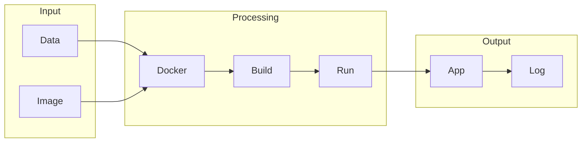

# Containerization

## What is Containerization
Containerization is a technology that allows developers to package their applications with all the necessary dependencies, so they can run anywhere, without worrying about the underlying environment. This is achieved by creating a lightweight and portable environment that includes the application code, libraries, and configurations. In essence, containerization provides a consistent and efficient way to deploy applications across different machines and environments.

## What problem it solves
Before containerization, developers faced the problem of inconsistent environments. Each machine had its own setup, libraries, and configurations, which made it challenging to deploy applications across different environments. This led to a lot of headaches, and developers had to rely on resource-heavy virtual machines or manual setup of environments, which was time-consuming and prone to errors. Containerization solves this problem by providing a lightweight way to create consistent and portable environments.

## How it works internally
Containerization works internally by using a series of automated tasks that are executed in a specific order. These tasks are represented by nodes, which are the building blocks of a workflow. Each node has a specific function, such as sending an email, making an API call, or performing data manipulation. Nodes can be connected to each other to create a flow of tasks. The workflow is initiated by a trigger, which can be an event or a schedule. Once the trigger is activated, the workflow begins to execute from the starting node.

## Workflow overview
The workflow overview can be represented by the following diagram:

This diagram shows the input, processing, and output stages of a containerization workflow. The input stage includes the data and image, which are used to build the container. The processing stage involves building and running the container, and the output stage includes the application and log.

## Step by step execution flow
The step-by-step execution flow of a containerization workflow is as follows:
1. **Trigger Activation**: A trigger is activated, either by an event or a schedule.
2. **Starting Node Execution**: The starting node of the workflow is executed. This node performs its specific task, such as making an API call or sending an email.
3. **Node Completion**: When the starting node completes its task, it passes the output to the next connected node.
4. **Node Connection**: The next node in the workflow receives the output from the previous node and performs its own task.
5. **Conditional Logic**: If a node has conditional logic, it evaluates the conditions based on the input it received. If the conditions are met, the node executes its task.
6. **Node Branching**: If a node has multiple outputs or branches, the workflow splits into multiple paths based on the conditions or logic.
7. **Error Handling**: If a node encounters an error, the workflow can be configured to handle the error, such as sending a notification or retrying the task.

## Real world use cases
Containerization has several real-world use cases, including:
1. **Web application deployment**: Companies like Netflix use containerization to package their web applications and deploy them on cloud platforms.
2. **Continuous integration and testing**: Containerization is used in continuous integration and testing workflows to create isolated environments for building and testing software.
3. **Database deployment**: Containerization is used to deploy and manage databases, such as MySQL or PostgreSQL, in a production environment.

## Limitations and trade-offs
While containerization provides several benefits, it also has some limitations and trade-offs. For example, containerization can be complex to set up and manage, especially for large-scale applications. Additionally, containerization requires a significant amount of resources, such as memory and CPU, to run efficiently. However, the benefits of containerization, such as consistency and efficiency, often outweigh the limitations and trade-offs.

## Practical closing thoughts
 containerization is a powerful technology that provides a lightweight and efficient way to deploy applications across different environments. By understanding how containerization works internally and how it can be used in real-world scenarios, developers can take advantage of its benefits and improve the consistency and efficiency of their application deployments. As with any technology, containerization has its limitations and trade-offs, but with careful planning and management, it can be a valuable tool in any developer's toolkit.