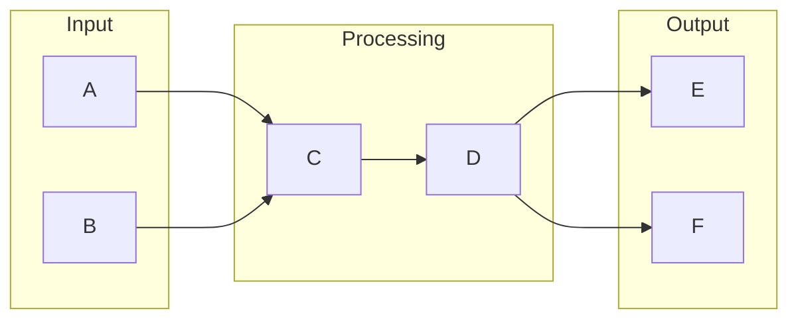

# Dify

# 1. What is Dify
Dify is a tool designed to simplify data integration and automation. It aims to provide a more efficient and user-friendly way to manage data integration, allowing users to focus on higher-level tasks rather than spending hours writing code and debugging scripts. The concept of Dify is to bridge the gap between different systems, enabling seamless data transfer and synchronization.

# 2. What problem it solves
Before tools like Dify, automation was handled through manual scripting, APIs, or custom integrations. This approach required significant technical expertise and was often time-consuming. People had to write code to connect different systems, transform data, and handle errors, which was a tedious and prone-to-error process. Dify solves this problem by providing a more accessible and automated way to manage data integration, reducing the need for manual scripting and minimizing the risk of errors.

# 3. How it works internally
From an engineering perspective, Dify's internal workings can be understood by looking at n8n workflows. A workflow in n8n is essentially a series of connected nodes that process and transform data. These nodes are the building blocks of a workflow, and each represents a specific operation, such as fetching data from an API or sending an email. The nodes are connected, allowing data to flow from one node to the next. Triggers, a special type of node, initiate the execution of a workflow, which can be scheduled to run at specific intervals or activated by external events.

# 4. Workflow overview
The workflow overview can be visualized using the following diagram:

This diagram illustrates the flow of data from input nodes to processing nodes and finally to output nodes. Each node processes the data, and the output of one node becomes the input for the next connected node.

# 5. Step by step execution flow
The execution flow of a workflow in Dify involves the following steps:
1. **Trigger activation**: A trigger is activated, which initiates the execution of the workflow.
2. **Node execution**: Each node in the workflow is executed in sequence, with each node processing the data and passing it to the next connected node.
3. **Logic and conditions**: Logic and conditions are evaluated within nodes or using special nodes called "IF" nodes, allowing users to define conditional statements that adjust the execution flow.
4. **Data flow**: As the workflow executes, data flows from one node to the next, with each node modifying, transforming, or appending data.
5. **Error handling**: If an error occurs during the execution of a node, the workflow can be configured to handle the error, such as retrying the node or sending an error notification.

# 6. Real world use cases
Although Dify is not a well-known tool, we can assume it is a data integration or workflow automation tool. Here are three hypothetical use cases:
* A company uses Dify to connect its e-commerce platform to its inventory management system, allowing it to automatically update product availability and track orders.
* A marketing team uses Dify to integrate its customer relationship management (CRM) system with its email marketing platform, enabling it to synchronize contact lists and campaign data.
* A financial institution uses Dify to automate the transfer of transaction data from its online banking system to its accounting software, streamlining its financial reporting process.

# 7. Limitations and trade-offs
While Dify aims to simplify data integration and automation, it may have limitations and trade-offs. For instance, the use of pre-built nodes and workflows may limit the flexibility of the tool, and the need for a user-friendly interface may compromise on advanced features. Additionally, the reliance on triggers and scheduled workflows may introduce dependencies on external systems, which can be a single point of failure.

# 8. Practical closing thoughts
 Dify is a tool designed to simplify data integration and automation by providing a more accessible and automated way to manage data integration. Its internal workings can be understood by looking at n8n workflows, which involve connected nodes that process and transform data. While Dify may have limitations and trade-offs, it has the potential to streamline data integration and automation processes, allowing users to focus on higher-level tasks. As with any tool, it is essential to evaluate its capabilities and limitations before implementing it in a real-world scenario.