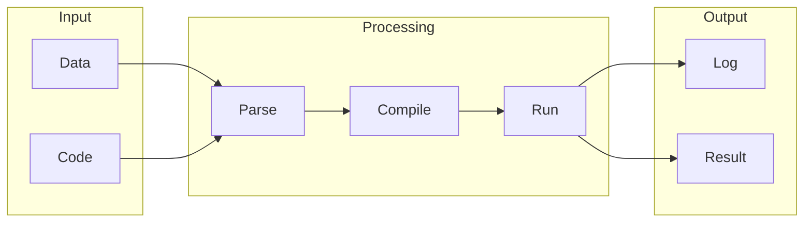

# TypeScript

## What is TypeScript
TypeScript is a programming language that exists to help with JavaScript development. It was created to address the limitations of JavaScript, which is dynamically typed. This means that JavaScript does not check the types of variables at compile time, leading to errors that only appear at runtime. In essence, TypeScript is a superset of JavaScript that adds optional static typing and other features to improve the development experience.

## What problem it solves
The main problem that TypeScript solves is the lack of type safety in JavaScript. As JavaScript applications grew in complexity, it became harder to maintain and debug them. Errors due to type mismatches were common and hard to track down. Before TypeScript, developers had to rely on manual testing and debugging to catch type-related errors. They also used tools like JSLint or JSHint to check for syntax errors and coding style issues, but these tools did not provide the same level of type checking as TypeScript.

## How it works internally
TypeScript works by adding a layer of type checking to JavaScript. It does this by using a compiler that checks the types of variables at compile time, rather than at runtime. This helps to catch type-related errors early in the development process, making it easier to maintain and debug complex JavaScript applications. The compiler also generates JavaScript code that can be executed by web browsers or other JavaScript runtimes.

## Workflow overview
A workflow in the context of TypeScript development can be thought of as a series of automated tasks that are executed in a specific order. This can be represented by the following diagram:

This diagram shows the overall flow of a TypeScript workflow, from input to output. It includes the parsing of code, compilation to JavaScript, and execution of the resulting code.

## Step by step execution flow
Here's a step-by-step explanation of how the execution flow works:
1. **Code Creation**: The developer writes TypeScript code, which is then compiled to JavaScript.
2. **Compilation**: The TypeScript compiler checks the types of variables and generates JavaScript code.
3. **Code Execution**: The resulting JavaScript code is executed by a web browser or other JavaScript runtime.
4. **Error Handling**: If any errors occur during execution, they are caught and logged.
5. **Result**: The final result of the execution is output to the user or stored for later use.
6. **Iteration**: The process is repeated as needed, with the developer refining the code and recompiling it until the desired result is achieved.

## Real world use cases
TypeScript is used in a variety of real-world applications, including:
* Airbnb uses TypeScript to develop its web application, where developers write TypeScript code that is then compiled to JavaScript.
* Microsoft uses TypeScript to build its Visual Studio Code editor, where the editor's core functionality is written in TypeScript.
* LinkedIn uses TypeScript to develop its mobile application, where developers write TypeScript code that is then compiled to JavaScript and executed on the mobile device using a framework like React Native.

## Limitations and trade-offs
TypeScript is not a replacement for JavaScript, but rather a tool that helps developers write better JavaScript code. It has its own set of limitations and trade-offs, including:
* **Steeper learning curve**: TypeScript requires developers to learn a new syntax and set of concepts, which can be time-consuming.
* **Additional overhead**: The compilation step adds overhead to the development process, which can slow down development.
* **Compatibility issues**: TypeScript code may not be compatible with all JavaScript libraries or frameworks, which can limit its use.

## Practical closing thoughts
 TypeScript is a powerful tool that can help developers write better JavaScript code. It provides a layer of type checking and other features that can improve the development experience. While it has its limitations and trade-offs, the benefits of using TypeScript can outweigh the costs. By understanding how TypeScript works and how to use it effectively, developers can write more maintainable, efficient, and scalable JavaScript code. As the complexity of JavaScript applications continues to grow, the use of TypeScript is likely to become more widespread, and its benefits will become more apparent.