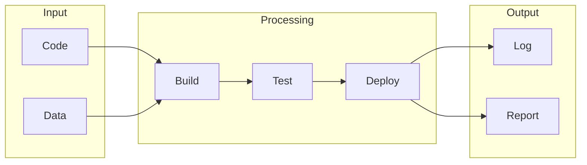

# DevOps Tools

## What is DevOps Tools
DevOps tools exist to bridge the gap between development and operations teams. They were created to address the inefficiencies and delays in software deployment caused by the disconnect between these two teams. Before DevOps tools, development and operations teams worked in silos, with developers writing code and then handing it off to operations teams to deploy and manage. This manual, time-consuming, and error-prone process led to the development of DevOps tools.

## What problem it solves
The primary problem that DevOps tools solve is the manual, time-consuming, and error-prone process of deploying and managing software. Before these tools, automation was handled through scripting and manual processes, which were tedious and fragile. If something changed, the script would break, and the team would have to start over. DevOps tools provide a more streamlined and automated way of managing the software development lifecycle. They help to reduce the gap between development and operations teams, making it easier to deploy and manage software.

## How it works internally
Let's break down the internal workings of DevOps tools, specifically n8n, from an engineering perspective. A workflow in n8n is a series of automated tasks that are executed in a specific order. It's essentially a blueprint that defines how different tasks are connected and executed. A workflow can be thought of as a flowchart, where each step represents a specific task or action. The building blocks of a workflow in n8n are nodes. A node represents a single task or action, such as sending an email, making an API call, or moving a file. Each node has its own set of inputs, outputs, and configuration options. Nodes can be connected to each other to create a workflow, allowing data to flow from one node to another.

## Workflow overview
Here's an overview of the workflow:

This diagram shows the different stages of a workflow, from input to output. The input stage includes code and data, which are then processed through build, test, and deploy stages. The output stage includes logging and reporting.

## Step by step execution flow
Here's how the execution flows step by step:
- The trigger is activated, which starts the execution of the workflow.
- The first node in the workflow is executed, which performs its designated task.
- The output of the first node is passed to the next node in the workflow.
- The next node executes, using the output from the previous node as its input.
- This process continues, with each node executing in sequence, until the end of the workflow is reached. Within each node, logic and conditions are evaluated, allowing for complex decision-making and workflow branching. The node execution involves receiving input data, evaluating configuration options, performing the designated task, generating output data, and logging any errors or exceptions.

## Real world use cases
DevOps tools have many real-world use cases. Here are a few examples:
* Continuous Integration: In a software development team, Jenkins is used to automatically build and test code changes as soon as they are committed to the repository.
* Infrastructure Automation: A company uses Ansible to manage and configure its server fleet. Ansible playbooks are written to define the desired state of the servers, and then Ansible applies these configurations to ensure consistency across all servers.
* Monitoring and Logging: A web application team uses Prometheus and Grafana to monitor the performance of their application. Prometheus collects metrics from the application and stores them in a time-series database, while Grafana is used to visualize these metrics in dashboards.

## Limitations and trade-offs
While DevOps tools provide many benefits, they also have some limitations and trade-offs. One of the main limitations is the complexity of setting up and configuring these tools. It can take a significant amount of time and effort to get everything working smoothly. Additionally, DevOps tools can be expensive, especially for large-scale deployments. There are also trade-offs to consider, such as the trade-off between automation and flexibility. Highly automated workflows can be less flexible and more difficult to change than manual processes.

## Practical closing thoughts
 DevOps tools are a powerful solution for bridging the gap between development and operations teams. They provide a more streamlined and automated way of managing the software development lifecycle, reducing the manual, time-consuming, and error-prone process of deploying and managing software. By understanding how DevOps tools work internally and how they can be applied in real-world use cases, teams can make informed decisions about how to implement these tools in their own workflows. With the right configuration and setup, DevOps tools can help teams to improve their efficiency, reduce errors, and increase their overall productivity.