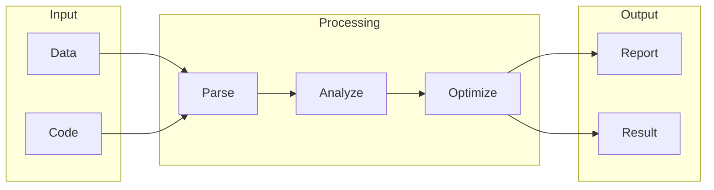

# Faircode

## What is Faircode
Faircode is a tool designed to ensure fairness and transparency in code reviews. It addresses the limitations of manual code reviews, which can be time-consuming and prone to human bias. Before Faircode, code reviews relied heavily on human judgment, leading to inconsistent and potentially unfair reviews. The increasing complexity and scale of software development also made manual reviews impractical and error-prone.

## What problem it solves
The primary problem Faircode solves is the lack of objectivity and consistency in manual code reviews. As codebases grew, manual reviews became impractical, and automation was limited to basic scripts and tools that couldn't understand code context and nuances. Faircode provides a more comprehensive and unbiased approach to code reviews, helping to identify and address potential biases in software development.

## How it works internally
Faircode, also known as n8n, works internally through a series of connected nodes that process and transform data. A workflow is defined using a JSON file or the n8n UI, including nodes, their connections, and the data that flows between them. Nodes are the building blocks of a workflow, representing specific tasks or operations, such as fetching data from an API or transforming data. Triggers, a type of node, start a workflow, injecting data that flows through connected nodes. The execution flow continues until the end of the workflow, with each node executing its specific task and passing output to the next connected node.

## Workflow overview
The workflow overview can be visualized using the following diagram:

This diagram illustrates the flow of data through the Faircode workflow, from input to processing and finally to output.

## Step by step execution flow
Here's a step-by-step breakdown of the execution flow:
* A trigger activates the workflow, injecting data into the first node.
* The first node processes the data and passes it to the next connected node.
* Each subsequent node executes its specific task, such as making API calls or performing data transformations.
* Logic and conditions are evaluated within nodes or through special "IF" nodes, allowing for conditional routing of data.
* Data flows through the nodes, stored in memory, until it reaches the end of the workflow.
* If a node fails or throws an error, the workflow is paused, and the error is logged.

## Real world use cases
Faircode has various real-world use cases, including:
* Auditing AI systems to detect bias in loan approval algorithms
* Testing fairness in facial recognition systems
* Ensuring fairness in candidate selection for hiring algorithms
These use cases demonstrate Faircode's versatility and potential to promote fairness and transparency in various applications.

## Limitations and trade-offs
While Faircode offers a more comprehensive approach to code reviews, it's essential to acknowledge its limitations and trade-offs. For instance, Faircode may not fully replace human judgment, as it relies on predefined rules and workflows. Additionally, creating and maintaining complex workflows can be time-consuming and require significant expertise. These trade-offs must be considered when implementing Faircode in a development environment.

## Practical closing thoughts
 Faircode is a valuable tool for ensuring fairness and transparency in code reviews. By understanding how it works internally and its various use cases, developers can effectively leverage Faircode to promote fairness and consistency in their software development projects. While it's essential to acknowledge the limitations and trade-offs, Faircode has the potential to make a significant impact in the development community. As with any new technology, it's crucial to approach Faircode with a practical and nuanced perspective, recognizing both its benefits and limitations.