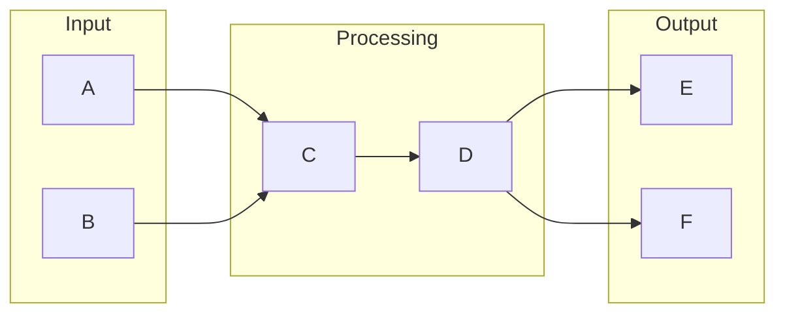

# Workflow Automation

## What is Workflow Automation
Workflow automation is a way to streamline repetitive tasks and improve efficiency in business processes. It exists because people wanted to simplify and automate the complex, time-consuming, and error-prone manual processes that were prevalent before its advent. By automating workflows, companies can reduce the likelihood of human error, increase productivity, and enhance overall efficiency. At its core, workflow automation involves the use of software tools to define, execute, and manage workflows, which are essentially a series of tasks that need to be performed in a specific order.

## What problem it solves
The problem that workflow automation solves is the complexity of business processes. As companies grow, their workflows become more intricate, involving multiple teams and tasks, which can lead to bottlenecks, delays, and mistakes. Before the advent of workflow automation tools, automation was handled through custom scripts, manual coding, or even just doing things manually. This approach was not only time-consuming but also required significant technical expertise, making it difficult to scale and maintain. Workflow automation tools address this issue by providing a way to automate workflows without requiring extensive coding knowledge.

## How it works internally
To understand how workflow automation works internally, let's break it down from an engineering perspective. In a workflow automation system like n8n, a workflow is defined as a series of tasks that are executed in a specific order. This workflow is essentially a directed graph where each node represents a task, and the edges represent the flow of data between these tasks. The workflow is defined by the user through a visual interface or by writing JSON code that describes the workflow structure. The building blocks of a workflow are nodes, which perform specific functions such as sending an email, making an API request, or transforming data. There are different types of nodes, including trigger nodes, action nodes, and function nodes, each serving a distinct purpose in the workflow.

## Workflow overview
Here's a high-level overview of a workflow, including a diagram:

In this diagram, the workflow starts with input nodes A and B, which provide the initial data for the workflow. This data is then processed by nodes C and D, which perform specific functions such as data transformation or API calls. The output of these nodes is then passed to output nodes E and F, which represent the final outcome of the workflow.

## Step by step execution flow
When a trigger node is activated, the workflow execution begins. Here's a step-by-step overview of how the execution flows:
* The trigger node executes and generates output data.
* The output data from the trigger node is passed to the next node in the workflow.
* Each node in the workflow executes in sequence, with the output from one node becoming the input for the next node.
* If a node encounters an error during execution, the workflow may stop, or it may continue executing depending on the error handling configuration.
* The workflow continues to execute until all nodes have been processed or until a termination condition is met.

## Real world use cases
Workflow automation has numerous real-world use cases, including:
* Employee onboarding: automating the creation of digital folders, email notifications, and task assignments for new employees.
* Invoice processing: automating the extraction of relevant information from invoices, routing them to approvers, and updating accounting systems.
* Customer complaint resolution: automating the assignment of customer complaints to service representatives, tracking progress, and escalating issues to managers.

## Limitations and trade-offs
While workflow automation offers numerous benefits, it also has some limitations and trade-offs. For example, workflow automation tools can be complex to set up and require significant upfront investment. Additionally, workflows can become rigid and inflexible if not designed properly, making it difficult to adapt to changing business requirements. Furthermore, workflow automation tools may not always be able to handle exceptions or edge cases, which can lead to errors or delays.

## Practical closing thoughts
 workflow automation is a powerful tool for streamlining repetitive tasks and improving efficiency in business processes. By understanding how workflow automation works internally and how to design and execute workflows effectively, companies can unlock significant benefits and improve their overall productivity. However, it's essential to be aware of the limitations and trade-offs of workflow automation and to approach its implementation in a thoughtful and practical manner. With the right approach, workflow automation can be a valuable addition to any company's toolkit, helping to simplify complex processes and drive business success.