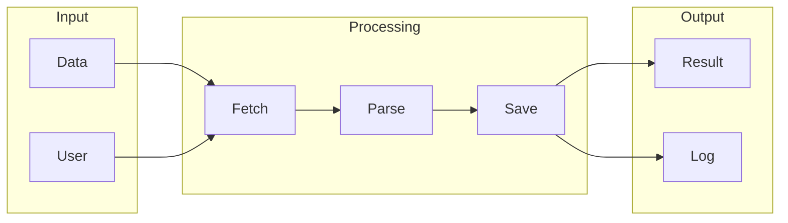

# Dify

## What is Dify
Dify is a tool designed to simplify data integration and automation. It aims to provide an efficient, scalable, and user-friendly solution for combining multiple data sources to gain insights. In essence, Dify is an attempt to address the pain point of data integration that many organizations face. 

## What problem it solves
The problem Dify solves is the complexity and maintenance nightmare associated with manual data integration. Before tools like Dify, data integration was done manually using custom scripts or generic ETL tools, which was time-consuming and prone to errors. As the number of data sources grew, so did the complexity of the integration process, making it difficult to maintain and scale. 

## How it works internally
From an engineering perspective, Dify works internally using the n8n workflow engine. The engine consists of a series of connected nodes that process and transform data. Each node represents a specific function or operation, and when a workflow is created, it's defined as a JSON object that contains a list of nodes and their connections. Nodes can be thought of as individual functions that take input data, process it, and produce output data. 

## Workflow overview
The workflow overview can be visualized using the following diagram:

This diagram shows the overall flow of data through the workflow, from input to processing to output. 

## Step by step execution flow
The step-by-step execution flow of Dify's workflow engine can be broken down into several steps:
* Step 1: Workflow Definition - A workflow is defined as a JSON object that contains a list of nodes and their connections.
* Step 2: Node Creation - Nodes are the building blocks of a workflow, each with a specific function.
* Step 3: Trigger Initialization - Triggers are used to start a workflow, waiting for a specific event to occur.
* Step 4: Execution Flow - The engine starts at the trigger node and moves step by step through the connected nodes.
* Step 5: Node Execution - Each node performs its specific function using the input data it received from the previous node.
* Step 6: Logic and Condition Evaluation - Logic and conditions are evaluated within nodes or using specialized nodes.
* Step 7: Data Flow - Data flows through the workflow, stored in memory and passed between nodes.
* Step 8: Error Handling - If an error occurs, the workflow engine catches the error and passes it to an error handling mechanism.
* Step 9: Workflow Completion - When the workflow reaches its final node, the execution is complete, and the final output data is stored or returned to the caller.

## Real world use cases
Dify can be used in various real-world scenarios, such as:
* A small business owner using Dify to track expenses by uploading receipts and invoices, which are then categorized and recorded in the platform's ledger.
* An individual investor utilizing Dify to monitor their investment portfolios by linking brokerage accounts to the platform.
* A freelancer using Dify to manage invoices and payments from clients by creating and sending digital invoices through the platform.

## Limitations and trade-offs
While Dify aims to simplify data integration and automation, it's not without its limitations and trade-offs. For instance, the complexity of the workflow engine can make it difficult to debug and maintain. Additionally, the use of a graphical interface to define workflows can be limiting for complex workflows. Furthermore, the engine's performance may be impacted by the number of nodes and connections in a workflow.

## Practical closing thoughts
 Dify is a tool designed to simplify data integration and automation. By understanding how it works internally and its workflow overview, users can better utilize the tool to address their data integration needs. While it has its limitations and trade-offs, Dify can be a valuable asset for organizations and individuals looking to streamline their data integration processes. As with any tool, it's essential to weigh the benefits and drawbacks and consider the specific use case before implementing Dify.