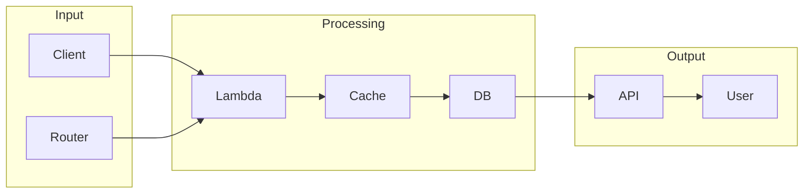

# Serverless Architecture

# 1. What is Serverless Architecture
Serverless Architecture is a design pattern that allows developers to build and deploy applications without managing servers. This approach abstracts away the underlying infrastructure, enabling developers to focus on writing code. In essence, it provides a virtual server that scales automatically, eliminating the need to worry about server management.

# 2. What problem it solves
The need for scalability and cost-effectiveness drove the development of Serverless Architecture. Traditional server-based architectures were inflexible and wasteful, as servers often sat idle, waiting for requests. Automation was handled through scripting and orchestration tools, but these required expertise in server management. Serverless Architecture simplifies this by abstracting away server management, allowing developers to concentrate on coding.

# 3. How it works internally
From an engineering perspective, Serverless Architecture can be understood by breaking down its internal workings. Using n8n as an example, we can see how it operates. The process involves creating a workflow, defining nodes, setting up triggers, and executing the workflow. Each node represents a specific task or operation, such as sending an email or making an API call. These nodes are connected to create a sequence of operations that are executed in a specific order.

# 4. Workflow overview
The workflow overview can be visualized using the following diagram:

This diagram illustrates the flow of data through a serverless system, from input to processing to output.

# 5. Step by step execution flow
The execution flow of a serverless workflow involves several steps:
1. **Workflow Creation**: A workflow is created by defining a series of tasks or nodes that are connected together.
2. **Node Definition**: Each node represents a specific task or operation, such as sending an email or making an API call.
3. **Trigger Setup**: Triggers are used to initiate the execution of a workflow, such as a scheduled time or an incoming HTTP request.
4. **Execution Flow**: The workflow engine starts executing the nodes in the workflow, one by one, in the order they are connected.
5. **Logic and Condition Evaluation**: Logic and conditions are evaluated at each node, using the input data and parameters defined for that node.
6. **Node Execution**: Each node performs its operation using the input data and parameters defined for that node.
7. **Error Handling**: If an error occurs during the execution of a node, the workflow engine catches the error and performs any necessary error handling.
8. **Workflow Completion**: When all nodes in the workflow have been executed, the workflow is considered complete.

# 6. Real world use cases
Serverless Architecture has various real-world applications:
1. **Image processing**: A serverless function can be triggered to resize and compress an image when a user uploads it to a website.
2. **Real-time data processing**: Serverless functions can process sensor data from IoT devices, extracting relevant information and storing the results in a database.
3. **Automated document conversion**: A serverless function can convert a document into different formats when it is uploaded to a cloud-based file sharing platform.

# 7. Limitations and trade-offs
While Serverless Architecture offers many benefits, it also has some limitations and trade-offs. Developers must consider the potential drawbacks, such as the need for expertise in serverless design patterns and the potential for increased costs if not managed properly.

# 8. Practical closing thoughts
 Serverless Architecture provides a powerful tool for building scalable and cost-effective applications. By understanding how it works internally and being aware of its limitations, developers can harness its potential to create efficient and effective solutions. As with any technology, it is essential to approach Serverless Architecture with a clear understanding of its benefits and trade-offs, and to use it judiciously to achieve the desired outcomes.