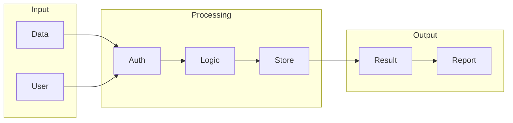

# Dify

## What is Dify
Dify is a tool designed to simplify data integration and automation. It helps connect different data sources and automate workflows, making it easier to manage and process data. At its core, Dify is a workflow automation tool that enables users to create custom workflows by connecting various nodes, each representing a specific task or operation.

## What problem it solves
The problem that led to the development of tools like Dify is the manual effort and complexity involved in integrating and automating data workflows. Before Dify, people had to write custom code or use multiple tools to connect different data sources, which was time-consuming and error-prone. This approach required a lot of technical expertise and was often brittle, meaning small changes could break the entire workflow. As a result, people spent too much time on data integration and automation, taking away from more strategic work.

## How it works internally
From an engineering perspective, Dify's internal workings can be broken down into several key components. The process starts with workflow creation, where a user creates a workflow through a graphical interface. This workflow represents a series of tasks that need to be executed in a specific order. The workflow is essentially a directed graph, where each node represents a task. Nodes are the building blocks of a workflow, and each node performs a specific operation, such as sending an email, making an API call, or executing a piece of code. Triggers are used to start the execution of a workflow, and they can be thought of as event listeners that wait for a specific event to occur before triggering the workflow.

## Workflow overview
Here's a high-level overview of the workflow process in Dify, illustrated in the following diagram:

This diagram shows the basic flow of a workflow in Dify, from input to output. The workflow starts with data and user input, which are then authenticated and processed using logic and conditional statements. The processed data is then stored, and the result is generated and reported.

## Step by step execution flow
The execution flow of a workflow in Dify can be broken down into several steps. First, a trigger is activated, which starts the execution of the workflow. The trigger passes any relevant data to the first node in the workflow. The first node is then executed, and it performs its specific operation. If the node has any outputs, the data is passed to the next node in the workflow. This process continues, with each node performing its operation and passing data to the next node, until the end of the workflow is reached. Logic and conditions are evaluated using specialized nodes, such as the "If" node or the "Switch" node. These nodes evaluate a condition and route the data to different nodes based on the result of the condition. If an error occurs during the execution of a node, the workflow is paused, and the error is propagated to the next node that can handle it.

## Real world use cases
Dify can be used in a variety of real-world scenarios. For example, a data analyst can use Dify to automate the process of extracting data from various sources, such as databases and spreadsheets, and then transforming the data into a suitable format for analysis. A business intelligence team can use Dify to integrate data from different systems, including customer relationship management and enterprise resource planning systems. A data scientist can use Dify to create a data pipeline that ingests data from social media platforms and other online sources, and then processes the data using natural language processing techniques.

## Limitations and trade-offs
While Dify simplifies data integration and automation, it's not without its limitations and trade-offs. One limitation is that Dify may not be suitable for very complex workflows that require a high degree of customization. In such cases, writing custom code may be more effective. Another trade-off is that Dify's graphical interface may not be as flexible as writing code, which can be a limitation for users who are used to coding. Additionally, Dify's scalability and concurrency may be limited by its architecture, which can be a concern for large-scale deployments.

## Practical closing thoughts
 Dify is a powerful tool for simplifying data integration and automation. Its graphical interface and node-based workflow make it easy to create and manage complex workflows. While it has its limitations and trade-offs, Dify can be a valuable addition to any data analytics or business intelligence toolkit. By understanding how Dify works internally and how to use it effectively, users can unlock its full potential and streamline their data workflows. As with any tool, it's essential to evaluate Dify's strengths and weaknesses and determine whether it's the right fit for your specific use case. With its ease of use and flexibility, Dify is definitely worth considering for anyone looking to simplify their data integration and automation workflows.