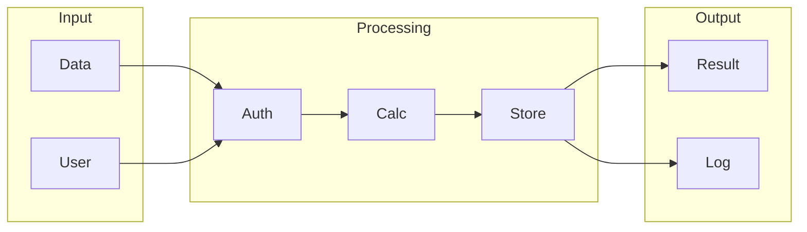

# Dify

## What is Dify
Dify is a tool designed to simplify data integration and automation. It's likely that people built tools like Dify to address the challenges of manual data integration, which can be time-consuming and prone to errors. Before Dify, data integration was probably done manually using scripts or custom code, requiring significant development and maintenance efforts. This approach was not only labor-intensive but also brittle, often breaking when systems or APIs changed.

## What problem it solves
The problem that forced people to build tools like Dify was the increasing amount of data being generated and the need to connect different systems and applications. Manual integration was becoming unmanageable, leading to errors, delays, and inefficiencies. Automation was handled through custom scripts, APIs, or manual data entry, requiring significant technical expertise. This approach took away from more strategic and high-value work, as people spent a lot of time writing and maintaining custom code.

## How it works internally
From an engineering perspective, Dify works using the n8n workflow engine. A workflow in n8n is a series of connected nodes that process and transform data. Each node represents a specific operation or function, and when a workflow is created, it's defined by a JSON object that describes the nodes, their connections, and the data that flows between them. Nodes are the building blocks of a workflow, performing specific functions like receiving data from an API, transforming data, or sending data to a database. There are various types of nodes in n8n, including trigger nodes, function nodes, and output nodes.

## Workflow overview
Here's an overview of the workflow process, including a diagram:

This diagram shows the basic flow of data through a workflow, from input to processing to output. The workflow engine manages the data flow between nodes, ensuring that each node receives the correct input data and produces the correct output data.

## Step by step execution flow
The execution flow begins when a trigger node is activated, sending a signal to the workflow engine to start executing the workflow. The workflow engine starts by executing the trigger node, which produces output data. This output data is then passed to the next node in the workflow, which processes the data and produces its own output. This process continues node by node, with each node processing the input data and producing output data. Logic and conditions are evaluated within nodes using a combination of built-in functions and user-defined expressions. If an error occurs during the execution of a node, the workflow engine catches the error and passes it to an error node.

## Real world use cases
Dify can be used in various real-world scenarios. For example, a small business owner can use Dify to manage their inventory by scanning barcodes of products as they are received and sold. The data is then stored in a cloud-based database, where it can be accessed and updated by staff members. A researcher can use Dify to collect and organize data from various sources, including spreadsheets, documents, and online databases. A marketing team can use Dify to create and schedule social media posts in advance, tracking engagement metrics and publishing posts automatically.

## Limitations and trade-offs
While Dify simplifies data integration and automation, it's not without its limitations and trade-offs. For example, the use of a workflow engine like n8n can introduce complexity, especially for large and complex workflows. Additionally, the reliance on nodes and triggers can make it difficult to debug and troubleshoot issues. Furthermore, the use of a JSON object to define workflows can be error-prone, especially for users who are not familiar with JSON.

## Practical closing thoughts
 Dify is a tool that simplifies data integration and automation by using a workflow engine like n8n. While it's not without its limitations and trade-offs, Dify can be a powerful tool for streamlining data workflows and automating tasks. By understanding how Dify works internally and how to use it effectively, users can unlock its full potential and achieve their goals more efficiently. As with any tool, it's essential to carefully evaluate the trade-offs and limitations of Dify and consider alternative solutions before making a decision.